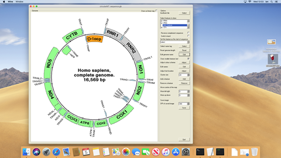
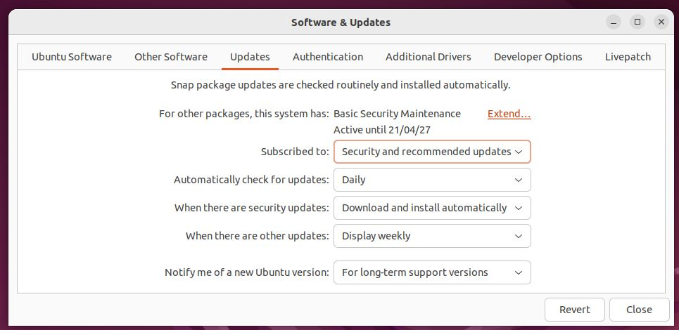

# Windows programs on a Linux or macOS desktop with Wine



While many programs are designed to run only on Windows PCs, it is possible to run most of them on Linux, BSD or macOS computers using [```Wine```](https://www.winehq.org/). According to Wine's [website](https://www.winehq.org): 
> Wine (originally an acronym for "Wine Is Not an Emulator") is a compatibility layer capable of running Windows applications on several POSIX-compliant operating systems, such as Linux, macOS, & BSD. Instead of simulating internal Windows logic like a virtual machine or emulator, Wine translates Windows API calls into POSIX calls on-the-fly, eliminating the performance and memory penalties of other methods and allowing you to cleanly integrate Windows applications into your desktop.

Basically, ```Wine``` sits in between a Windows application and the operating system and intercepts any messages they sent to each other and converts them from what they don't understand to something they do understand. This results in a program running as if it is on a Windows PC while in fact running in a Linux environment.

```Wine``` can work on a range of Unix inspired operating systems, such as various flavours of Linux, BSD and macOS. Whiles these operating systems have many similarities they tend to differ in how software is installed and which software repositories they favour. Consequently, how ```Wine``` is installed varies from operating system to operating system. The ```Wine``` website has instructions for installing ```Wine``` on Ubuntu, Debian, Fedora, macOS, SUSE, Slackware and FreeBSD on its [downloads page](https://wiki.winehq.org/Download). However, unlike installing applications on Windows, the process can be a little involved for some systems. Consequently, this repository contains a number of short guides that show how I installed ```Wine``` on:  

|OS|Comments|
|-|-|
|Arch linux 2024.06.01 |Installs .Net RunTime plus wine-mono|   
|Centos - Stream 9|Installs just 64 bit Wine|
|Debian - Trixie|Installs .Net RunTime plus wine-mono|  
|Elementary OS 7.1|Installs .Net RunTime plus wine-mono|  
|EndeavourOS - Gemini|Installs .Net RunTime plus wine-mono|
|Febora 40| Installs .Net RunTime plus wine-mono|  
|FreeBSD - 14.0_RELEASE|Installs .Net RunTime plus wine-mono|   
|Garuda - Xfce (240428)|Installs .Net RunTime plus wine-mono|
|GhostBSD - 24.04| Installs .Net RunTime plus wine-mono|   
|KDE Neon (20240624)|Installs .Net RunTime plus wine-mono| 
|macOS| Not attempted yet|
|Manjaro - Cinnamon 23.0.1| Installs .Net RunTime plus wine-mono (but not Winetricks)|
|Mint 21.3 (with Mate)| Installs .Net RunTime plus wine-mono|
|MX Linux 23.3 (KDE)|Installs .Net RunTime plus wine-mono|
|Nobara 39|Installs .Net RunTime plus wine-mono|
|openSUSE - Leap 15.5| Installs .Net RunTime plus wine-mono|
|POP! OS 22.02 (Gnome)|Installs .Net RunTime plus wine-mono (but not Winetricks)| 
|Raspberry Pi Desktop|Not attempted yet|  
|SlackWare - 15.0_RELEASE|Installs .Net RunTime plus wine-mono|  
|Ubuntu - Noble Numbat 24.04|Installs .Net RunTime plus wine-mono|  
|Zorin - Core 17 |Installs .Net RunTime plus wine-mono|

***Note:*** Wine-mono is required for programs using the .net 2 to 5 frameworks  
***Note:*** .Net runtime is required for programs using the .net 6 to 9 runtime installation  
***Note:*** Winetricks helps with some tasks, but is not essential for this work. Where the .net runtime was installed with Winetricks, it could also have been installed by downloading the runtime installation file and installing with Wine has shown for the [Elementary OS](elementaryOS.md#installing-winetricks-and-net-runtime)

The distros were chosen because they were on the Wine download page, in the top 10 most popular distros over the last 12 months (ending June 2024) on the [DistroWatch.com](https://distrowatch.com/dwres.php?resource=popularity) or because I'd worked with them in the resent past. For example Centos is a popular OS for HPC and headless servers in British universities.

I attempted to use a few other distros that ultimately ended in failure. These include a number of BSD distros which failed as their maintainers viewed desktops with destain! I give up on Gentoo as the installation seemed to be a task that was never going to end: The installation videos on Youtube were over 2 hours long. I also tried Scientific Linux as it seemed to be geared toward science type users, but gave up since it has now been superseded by Centos and none of the package managers seemed to work. Finally, CachyOS would not run on either a Virtualbox or HyperV for different reasons.  
     
These guides expect you to have the OS installed and also have a reasonable understanding of how to install applications on them or the willingness to search online for the solution to any issues. 

***Note***: The operating systems used in this guide were installed on two different types of virtual machines hosted: Oracle's VirtualBox on a Windows 10 computer and on Microsoft's Hyper-V on a Windows 11 PC, however, this should not affect how they functioned. The installation was performed on a freshly installed and updated virtual machine.

***Note***: The commands describing how to install ```Wine``` require admin/superuser rights which may mean that the installation needs to be done by the IT department on a work's computer. 

While the guides below discuss the operation of ```circularMT``` on various Linux OS's, the installation of other programs is the same. If the program is available as a ___*.msi___ file, install the application by issuing the command:

> wine ~/Downloads/myProgram.msi

where the file "myProgram.msi' in the installation file that was downloaded to the Downloads folder in your account's Home folder. If the program doesn't need installing and was just downloaded on to your computer it can be run by issuing the following command in a terminal:

> wine ~/Downloads/myProgram.exe

or for 64 bit programs

> wine64 ~/Downloads/myProgram_64.exe

where myProgram is the executable files which in this case is in your account's downloads folder.

## Install guides 

* [Arch Linux 2024.06.01](archLinux.md)
* [Centos - Stream 9](centos_9.md) 
* [Debian trixie](debian.md)
* [Elementary OS](elementaryOS.md)
* [EndeavourOS Gemini 2024-04-20](endeavourOS.md)
* [Fedora release 40](fedora.md)
* [FreeBSD 14.0-RELEASE](freeBSD.md)
* [Garuda - Xfce](garuda.md)
* [GhostBSD 24.04](ghostBSD-24-04.md)
* [KDE Neon](kde-neon.md)
* [macOS Mojave 10.14.6](macOS.md)
* [Manjaro - Cinnamon 23.0.1](manjaro.md)    
* [Mint 21.3](mint-21-3-mate.md)
* [MX Linux 23.2 KDE](mx-Linux-KDE.md)
* [Nobara 39](nobara.md)
* [openSUSE - 'Leap' 15.5:](openSUSE.md)
* [POP! OS](pop_os.md)
* [SlackWare - 15.0_RELEASE](slackware-15-0_RELEASE.md)
* [Raspberry Pi Desktop](raspberry_Pi_Desktop.md)
* [Ubuntu - 'Noble Numbat' 24.04:](ubuntu.md)
* [Zorin - Core 17.1](zorin-17.md)


## Installing the .Net framework

Some .Net applications require the .Net Runtime/Frame work to be installed. Currently there are versions 6 to 8 with version 9 in preview. The installation of these runtimes requires WineTrick to be installed as described in each guide above.

## Common issues

* [wine32 is missing](#wine32-is-missing)
* [wine-mono is missing](#wine-mono-is-missing)

### "wine32" is missing

If you get the message below when attempting to run wine on Ubuntu:

> it looks like wine32 is missing, you should install it.  
as root, please execute "apt-get install wine32"

open the Software & Updates form and select the Security and recommended updates option (Figure 1), enter your admin password (multiple times), close the form, update/reload if requested and then run the command:

> sudo apt-get install wine32

<hr />



Figure 1

<hr />

### "wine-mono" is missing

If not prompted to do so during the set up step, you may have to add a wine-mono package to the installation. This can be downloaded from the wine-mono [web page](https://dl.winehq.org/wine/wine-mono/) (https://dl.winehq.org/wine/wine-mono/), for this installation the [wine-mono-9.1.0-x86.msi](https://dl.winehq.org/wine/wine-mono/9.1.0/wine-mono-9.1.0-x86.msi) file was used. To link this file to the ```wine``` installation use the ```wine``` uninstaller by entering:

> wine uninstaller

or 

> wine64 uninstaller

in a terminal, pressing the ```Install``` button and selecting the file (Figure 2). The Wine Mono Runtime and Wine Mono Windows Support entries will only appear if the form is closed and then reopened.

<hr />


Figure 2

<hr />
