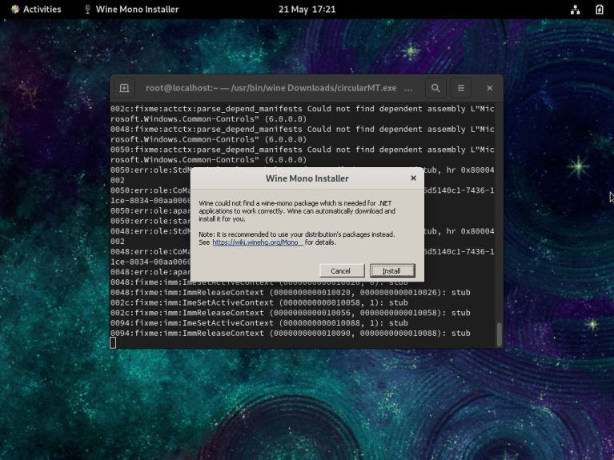
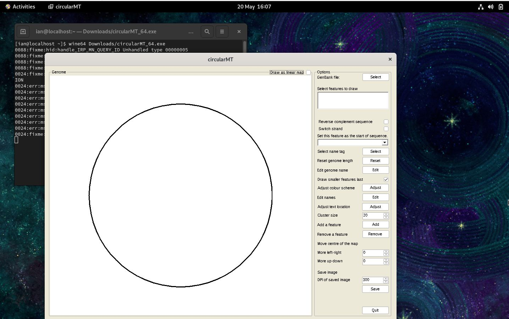
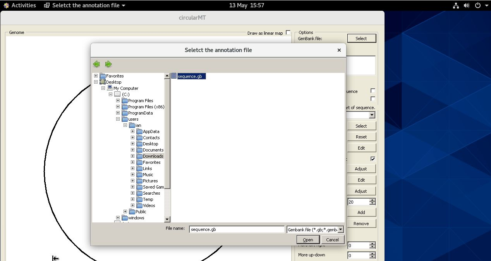
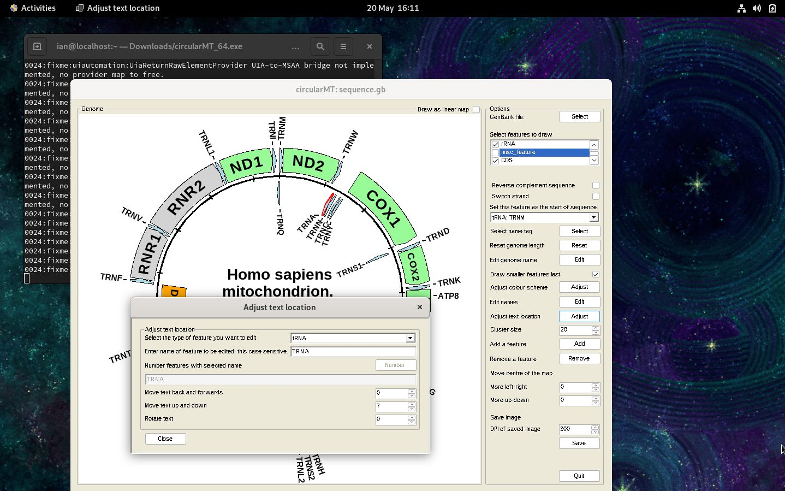

# Centos stream 8 and 9:

## Important

While the two methods below show how to install wine and wine64 on to Centos Stream 8 and 9, it seems that only wine64 can be installed on Centos at the moment. Consequently, download the circularMT_64.exe application and run with wine64.

## Centos machines

Centos Stream  8 and 9 were installed on a 64 bit virtual machine with 4,096 MB of RAM, 4 processors and 20 GB hard disk and was configured with default settings for a workstation with gnome as the desktop.

The circularMT_64.exe file and the sequence.gb files were downloaded from the GitHub (https://github.com/msjimc/circularMT) 'Program' and 'Example data' folders to the user's Download folder (~/Downloads) using FireFox. 

## Preparation 

It is suggested that the computer is updated and rebooted before starting the installation:

> sudo dnf -y update  
> sudo reboot

## Installation

* **The account performing the installation must have admin rights.**

### Using the yum package manager

Wine can be installed on Centos Stream 8 and 9 using the yum package manager (with admin rights). Wine is not in the standard repositories and so you need to link to the Extra Packages for Enterprise Linux (EPEL) repository with the following command:

> sudo dnf install epel-release 

and then install the wine package with: 

> sudo yom install wine 

 This will start the installation process by downloading and then installing a number of packages after asking for permission to install them. Once completed, when first using wine, it will perform and auto-configuring step and may request you allow the downloading of several files. Once completed, the auto-configuration will not run again.



Figure 1  Centos Stream 9

<hr />

### From source code

Unlike the installations on the other systems, ```Wine``` was also installed on Centos by compiling the source code as described by __onlycliches__ on the AlmaLinux forum: [[Script] Compile WINE with 32-Bit App Support](https://forums.almalinux.org/t/script-compile-wine-with-32-bit-app-support/2556). This page contains a script that compiles both the 32 and 64 - bit versions of ```wine```. It appears that things have changed a little since it was written and so needed two extra lines adding.    

> sudo dnf yum install dnf-plugins-core   
sudo yum config-manager --set-enabled crb  

in Centos 8 crb is called powertools: 

> sudo dnf yum install dnf-plugins-core   
sudo yum config-manager --set-enabled powertools  

The script can be viewed as containing 3 stages the first downloads the require files and packages and requires user interaction to authorise the downloads, this may take ~5 mins. The next part compiles ```wine``` and may take serval hours, but doesn't require user interaction. The final part installs and configures ```wine``` and requires you to OK a few steps via dialogue box(es).  

To run the installation script download the install.txt files from [here](https://github.com/msjimc/circularMT/Program) and then run it from a terminal with bash:

> bash ~/Downloads/install.txt

(Assumes the file is in your accounts Downloads folder.)

## Running circularMT

Once installed, download circularMT_64.exe and the sequence.gb file were downloaded from the GitHub (https://github.com/msjimc/circularMT) 'Program' and 'Example data' folders to our Downloads folder (~/Downloads) using FireFox and the issue the following commands 64 bit programs:
 
> wine64 ~/Downloads/circularMT_64.exe  

<hr />


Figure 1a  Centos Stream 8

<hr />



Figure 1b  Centos Stream 9

<hr />

As with the other installations on other Linux and BSD systems, circularMT displays the file system in the style of a Windows OS rather than a Linux system (Figure 2).

<hr /> 



Figure 2a Centos Stream 8

<hr />



Figure 2a Centos Stream 9

<hr />

Once, a mitochondrial genome has been imported, it's map can be modified as shown in the [Guide](../Guide/README.md) (Figure 3).

<hr />


Figure 3a Centos 8

<hr />


Figure 3a Centos 8

<hr />
