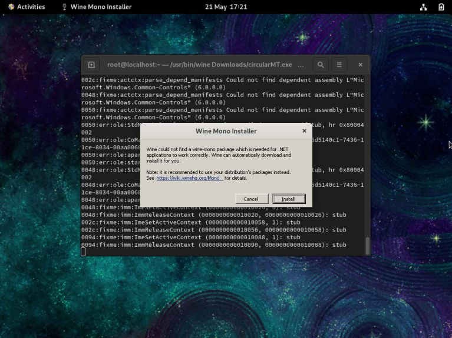
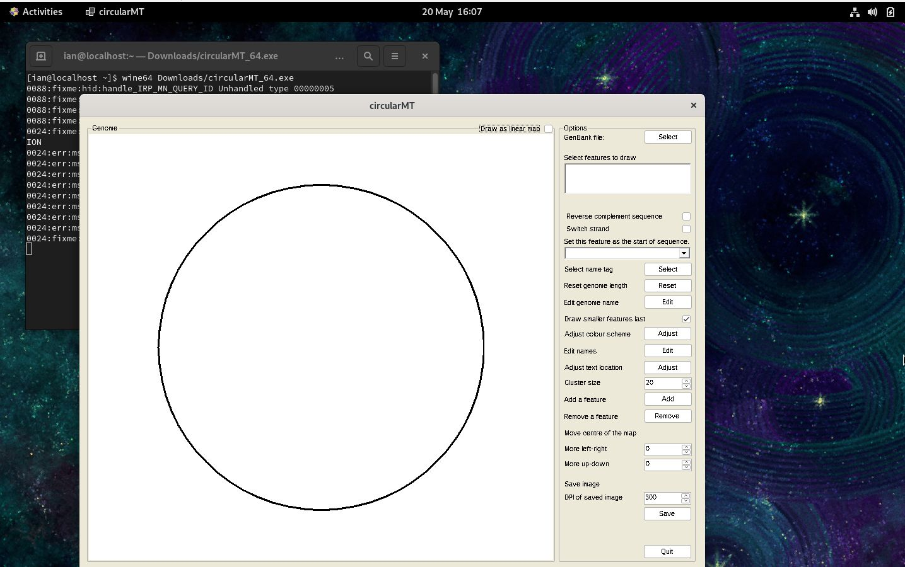
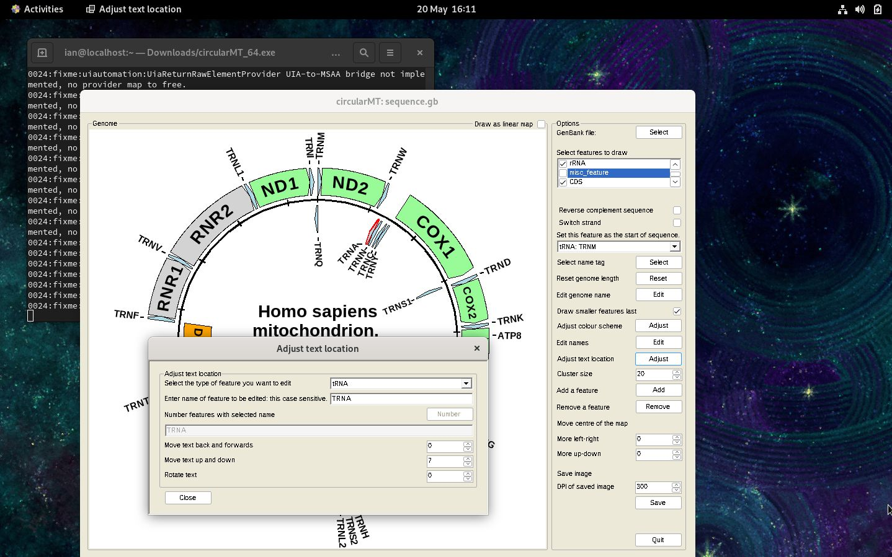

# CentOS stream  9:

CentOS Stream  9 was installed on a 64 bit virtual machine with 4,096 MB of RAM, 4 processors and VirtualBox 20 GB hard disk or Hyper-V: dynamically resizing hard disk and was configured with default settings for a workstation with Gnome as the desktop.

***Note*** CentOS appears not to have access to all the requirements for Wine to run on CentOS 64 bit to run 32 bit applications, but can run 64 bit Windows applications. Consequently, I download circularMT_64.exe below and not circular.exe.

The circularMT_64.exe file and the sequence.gb files were downloaded from the GitHub (https://github.com/msjimc/circularMT) 'Program' and 'Example data' folders to the user's Download folder (~/Downloads) using FireFox. 


## Preparation 

It is suggested that the computer is updated and rebooted before starting the installation:

> sudo dnf -y update  
> sudo reboot

## Installation

* **The account performing the installation must have admin rights.**

### Using the yum package manager

Wine can be installed on CentOS Stream 9 using the yum package manager (with admin rights). Wine is not in the standard repositories and so you need to link to the Extra Packages for Enterprise Linux (EPEL) and the CRB repositories with the following command:

> sudo dnf install epel-release   
> sudo yum install dnf-plugins-core   
> sudo yum config-manager --set-enabled crb 

Then install the wine package with: 

> sudo yum install wine 

 This will start the installation process by downloading and then installing a number of packages after asking for permission to install them. Once completed, run winecfg to configure the installation:

 > winecfg

 This will ask to install wine-mono (Figure 1) and end when it shows a second configuration dialogue box, which requires no modification.

<hr />



Figure 1:  CentOS Stream 9

<hr />

## Installing Winetricks but not .Net runtime

Winetricks can be installed with the command:

>  sudo yum install winetricks

Since the 32 - bit version of Wine cannot be installed on CentOS 9, it's not possible to install the .Net runtime as it contains some 32-bit code. 


Once installed, download circularMT_64.exe and the sequence.gb file from the GitHub (https://github.com/msjimc/circularMT) 'Program' and 'Example data' folders to our Downloads folder (~/Downloads) using Firefox and then issue the following commands for 64-bit programs:
 
> wine64 ~/Downloads/circularMT_64.exe  

As with installations on other Linux and BSD systems, circularMT displays the file system in the style of a Windows OS rather than a Linux system (Figure 2).

<hr /> 



Figure 2: CentOS Stream 9

<hr />

Once, a mitochondrial genome has been imported, it's map can be modified as shown in the [Guide](https://github.com/msjimc/circularMT/tree/master/Guide/README.md) (Figure 3).

<hr />



Figure 3: CentOS 9

<hr />

## Installing from source code

This folder contains a file [install.txt](install.txt) which contains the instructions to run from source code. The script refers to a wine-8.0.tar.xz, if you look in https://dl.winehq.org/wine/source/ you may find an earlier version of wine that will install correctly, however, the script takes a long time to run and I make no promises that it will work! 

```Wine``` was also installed on CentOS by compiling the source code as described by __onlycliches__ on the AlmaLinux forum: [[Script] Compile WINE with 32-Bit App Support](https://forums.almalinux.org/t/script-compile-wine-with-32-bit-app-support/2556). This page contains a script that compiles both the 32 and 64 - bit versions of ```wine```. It appears that things have changed a little since it was written and so the script needed two extra lines adding.


For CentOS Stream 9:

sudo yum install dnf-plugins-core
sudo yum config-manager --set-enabled crb

For CentOS Stream 8:

sudo yum install dnf-plugins-core
sudo yum config-manager --set-enabled powertools

It seems Powertools was renamed CRB in CentOS Stream 9

The script can be viewed as containing three stages the first downloads the required files and packages and requires user interaction to authorize the downloads, this may take ~5 mins. The next part compiles wine and may take several hours, but doesn't require user interaction. The final part installs and configures wine and requires you to okay a few steps via dialogue box(es). This means you can start the installation and then after a few minutes leave it to run overnight and then finish off in the morning.

To run the installation script download the install.txt file from [here](install.txt) and then run it from a terminal with bash:

bash ~/Downloads/install.txt

(Assumes the file is in your accounts Downloads folder.)
