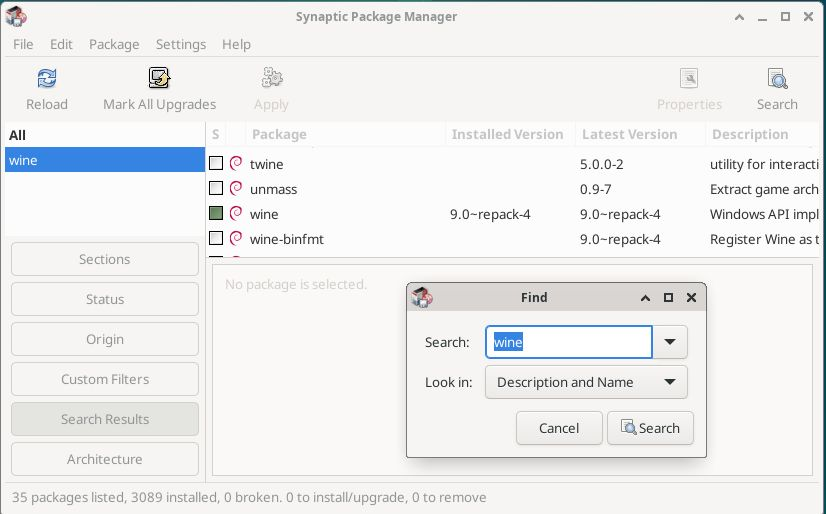
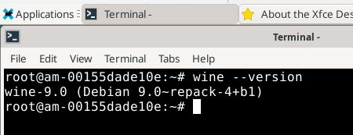
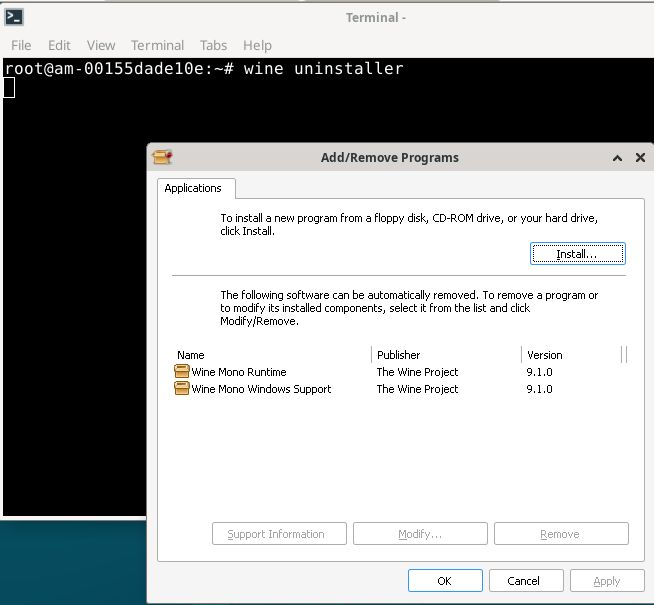
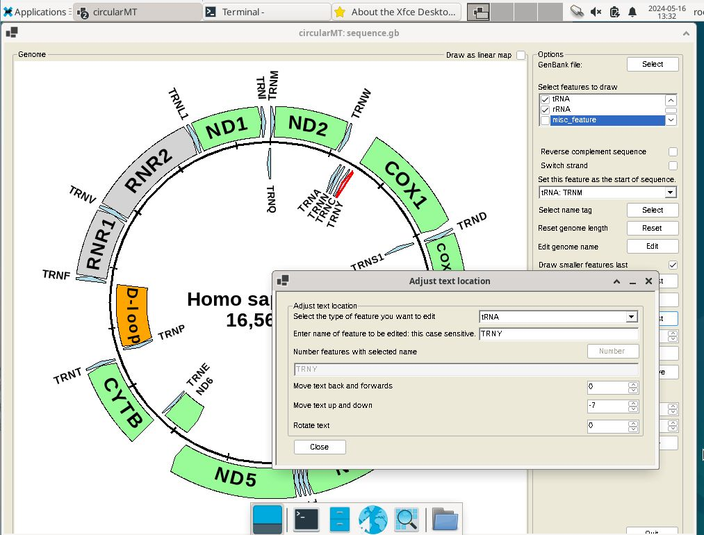

# Debian This is been update for .Net 6 installation
Debian GNU/Linux trixie was installed on a 64 bit virtual machine with 4,096 MB of RAM, 4 processors. VirtualBox used a 20 GB hard disk while HyperV used a dynamically resizing hard disk. Both installations were configured with default settings with the Xfce desktop.

***Note:*** This show the installation of WIne using the Synaptic package manager which install Wine64 only and then the command line installation of the 32 bit Wine which allows the installation of the.Net 6 runtime (or .net 8/9). While this is the 64 bit .Net runtime some components are 32 bit, hence the need for 32 bit Wine.

The circularMT_64.exe file and the sequence.gb file were downloaded from the GitHub (https://github.com/msjimc/circularMT) 'Program' and 'Example data' folders to the user's Download folder (~/Downloads) using FireFox.

## Preparation and installation of Wine64using Synaptic package manager

The images for the installation of ***Wine*** relate to the __Debian Trixie installation.

* **The account performing the installation must have admin rights for some step, while other can#t be performed as root.**

The ```Synaptic package Manager``` app was opened and the ```Search``` icon was pressed to display the ```Find``` dialogue box. After entering the term: ***Wine*** and pressing the ```Search``` button, a list of packages was displayed. Scrolling down the list revealed the wine package.  Clicking on the check box by ***wine*** item displayed the dependencies, while pressing the ```Apply``` button installed ```wine``` and ```wine64``` (Figure 1).

<hr />



Figure 1

<hr />

A terminal was opened and the installation checked (Figure 2) by entering the command:

>$  wine --version  
wine-9.0

(However on a Debian 11.9 installation this will install wine version 5.0 due to the packages available to the earlier build. This version is sufficient to run most programs without issue.) 

<hr />



Figure 2: Wine 9.0 is installed on Debian GNU/Linux trixie/sid

<hr />

## Preparation and installation of 32 bit Wine via the command lie

First add access to  32 bit  packages in the repositories:

> sudo dpkg --add-architecture i386 && apt-get update 

    If you are not in sudo log in as root with:

    > su -l root  

    And omit sudo in subsequent commands, but log out of root for the winecfg step

Then Wine is installed with: 

sudo apt-get install wine

Test the installation with:

> wine --version

which should state wine 9.0 (are higher)

### Linking Wine to the wine-mono file

You can either manually download the wine-mono file and link it to the Wine installation or run the winecfg command that will both link Wine to the wine-mono file and configure Wine.

#### winecfg

The command:

> winecfg

will both download the wine-mono file and link it to the Wine installation as well as configure your Wine environment. __This command will fail if you are running as root__.

However, if you have ran winecfg earlier, the command may fail with a message similar too:

> wine: could not load kernal32.dll, status c0000135

In this case delete the .wine folder in your home folder:

> rm -r ~/.wine

And rerun winecfg

#### Manually link to wine-mono

The [wine-mono-9.1.0-x86.msi](https://dl.winehq.org/wine/wine-mono/9.1.0/wine-mono-9.1.0-x86.msi) file was downloaded from https://dl.winehq.org/wine/wine-mono/9.1.0/ to the user's Download folder and in a terminal the following command was entered:

> wine uninstaller

or 

> wine64 uninstaller

which opened the ```Add/remove Programs``` dialogue box (Figure 3). Press the ```Install``` button to select the ***wine-mono-9.1.0-x86.msi*** (Figure 2: note the lower panel will remain blank and will only become populated when reopened). This step may take a while to complete, so don't close the form straight away.

<hr />



Figure 3

<hr />

## Installing Winetricks and .Net 6 (or above)

Winetricks is in the contrib repository which needs adding to the list by opening the repository list file (/etc/apt/sources.list) in nano with admin rights (__DO NOT USE A GUI TEXT EDIT LIKE LIBREOFFICE__) and adding __contrib__ to the six lines starting with deb as shown:

> deb http://deb.debian.org/debian trixie main contrib non-free non-free-firmware  
> deb-src http://deb.debian.org/debian trixie main contrib non-free non-free-firmware  

> deb http://deb.debian.org/debian-security/ trixie-security main contrib non-free non-free-firmware  
> eb-src http://deb.debian.org/debian-security/ trixie-security main contrib non-free non-free-firmware    

> deb http://deb.debian.org/debian trixie-updates main contrib non-free non-free-firmware  
> deb-src http://deb.debian.org/debian trixie-updates main contrib non-free non-free-firmware  

This should be done using nano rather than a GUI driven text editor like the one in  LibreOffice. Save the changes to the files and the update apt-get:

> apt-get update

and then install Winetricks with:

> apt-get install winetricks

Finally install the .Net 6 runtime with:

winetricks -q dotnetdesktop6

if this fails to work or you don't want to install Winetricks download the .Net 6 runtime (or 8/9) from  [here]
(https://dotnet.microsoft.com/en-us/download/dotnet/6.0) selecting the appropriate ***Windows*** 64 bit version from the __.NET Desktop Runtime 6.0.32__ section. Install the runtime with the command (the runtime file name may differ):

> wine windowsdesktop-runtime-6.0.32-win-x64.exe

This will open a dialogue box asking whether you want to install the runtime.


## Using Wine to run a Windows .Net program

```Wine``` was then used to run circularMT with the following command:

> wine ~/Downloads/circularMT.exe

When first run, ```Wine``` may undergo a configuration step before displaying the circularMT interface (Figure 3) if you didn't run winecfg after installing Wine.

Once running, data can be imported as described in the [Guide](https://github.com/msjimc/circularMT/tree/master/Guide/README.md). While circularMT is running on Debian, the file system will appear like a Windows based system rather than a Linux file system. While the user's Download folder is in /home/username/Downloads on Debian it appears to be in c:/users/<username>/Downloads/ to programs running with Wine. Once imported, the mitochondrial genome can be modified as described in the [Guide](https://github.com/msjimc/circularMT/tree/master/Guide/README.md) Figure 3.

<hr />



Figure 3

<hr />

