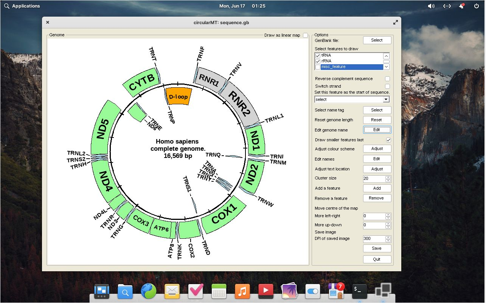

# Elementary OS 7.1:

## Starting point
Elementary OS 7.1 was installed on a 64 bit virtual machine with 4,096 MB of RAM, 4 processors and on VirtualBox with 25 GB hard disk while on HyperV it had a dynamically resizing hard disk. Both installations were configured with default settings and the Elementary OS desktop.

The circularMT.exe file and the sequence.gb files were downloaded from the GitHub (https://github.com/msjimc/circularMT) 'Program' and 'Example data' folders to the user's Download folder using FireFox. 

## Preparation

## Installation

Elementary OS 7.1 is derived from Ubuntu so the installation is similar to the Ubuntu installation.  Initially, the system was prepared for 32 bit applications by entering the following command in a terminal:

> sudo dpkg --add-architecture i386 

Next the required repository was added:

> sudo mkdir -pm755 /etc/apt/keyrings  
> sudo wget -O /etc/apt/keyrings/winehq-archive.key https://dl.winehq.org/wine-builds/winehq.key

followed by the required source locations. For Ubuntu Noble Numbat 24.04 the command is:

> 	
sudo wget -NP /etc/apt/sources.list.d/ https://dl.winehq.org/wine-builds/ubuntu/dists/jammy/winehq-jammy.sources

***Note:*** This is different from the Ubuntu file, if you used the latest Ubuntu version you will install Wine 6.0.

Update the package information:

> sudo apt update

Finally ```Wine``` was installed using:

> sudo apt install --install-recommends wine-stable

Check the version with:

> wine --version

 or

> wine64 --version

which should be 9.0.

Wine is configured with:

> winecfg

This will prompt you to install the wine-mono file which you should do and finally show the Wine configuration dialogue window with which you can set the Windows version if desired.

## Running circularMT.exe

 To run ```circularMT``` download the program from https://githud.com/msjimc/circularMT to your Downloads folder and issue the command below:

> wine ~/Downloads/circularMT.exe 

This will open the program which can be used as described in the [guide]( https://github.com/msjimc/circularMT/tree/master/Guide/README.md).

<hr />



Figure 1

<hr />
