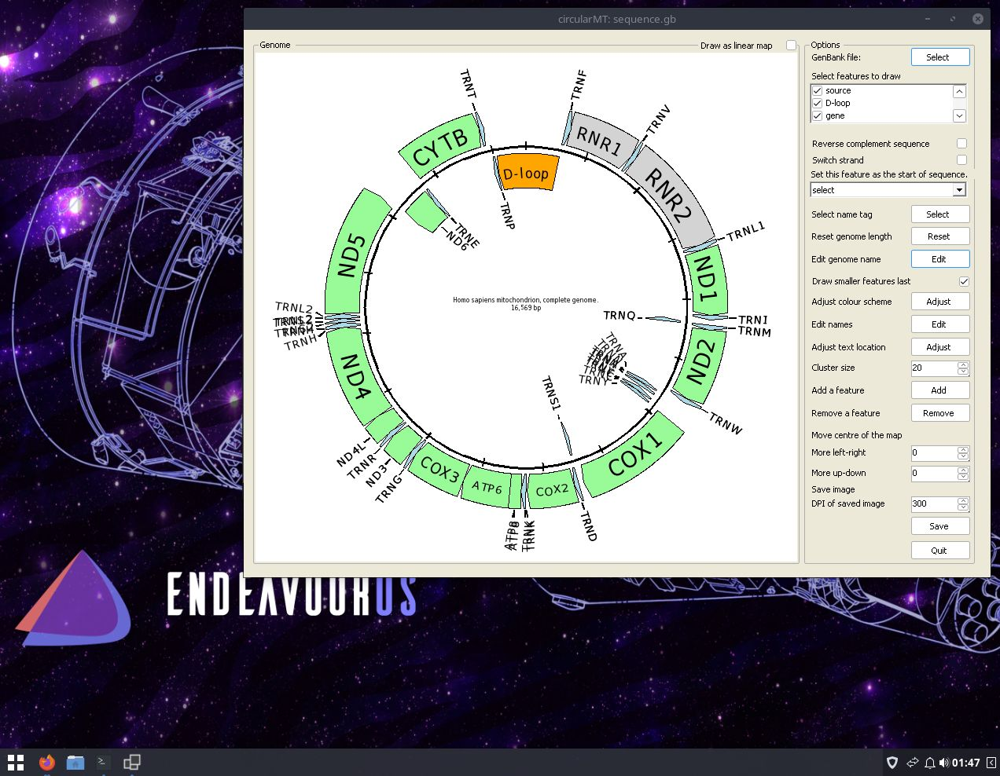

# EndeavourOS Gemini:

## Starting point
EndeavourOS Gemini 2024.04.20 was installed on two 64-bit virtual machines with 4,096 MB of RAM and 4 processors. The VirtualBox virtual machine had a 20 GB hard disk while Hyper-V's virtual machine had a dynamically resizing hard disk. Both installations were installed using  default settings and the Budgie desktop.

The circularMT.exe file and the sequence.gb files were downloaded from the GitHub (https://github.com/msjimc/circularMT) 'Program' and 'Example data' folders to the user's Downloads folder using Firefox. 

## Installation

At the end of the OS installation, it is possible to select which repositories to use at which point all were selected.

It is then recommended to do a full system update before any installation:

> sudo pacman -Syu

```Wine``` is installed with the dependencies wine-mono and wine-gecko by:

> sudo pacman -S wine wine-mono wine-gecko

The installation and version can be checked with:
 
> wine --version

and/or 

> wine64 --version

with both commands stating wine 9.11 is installed.

The installation is configured with:

> winecfg

## Installing Winetricks and the .Net runtime

Winetricks can be installed with the command:

> pacman -S winetricks

and then the runtime can be installed with:

> winetricks -q dotnetdesktop6

for the .Net 6 runtime. If the installation hangs, try the command:

> rm -rf ~/.wine ; WINEDLLOVERRIDES="winegstreamer=" winecfg

and rerun winetricks -q dotnetdesktop6


## Running a Windows program like circularMT.exe

 To run ```circularMT``` download the program from https://github.com/msjimc/circularMT to your Downloads folder and issue the command below:

> wine ~/Downloads/circularMT.exe 

This will open the program which can be used as described in the [guide]( https://github.com/msjimc/circularMT/tree/master/Guide/README.md).

<hr />



Figure 1

<hr />
