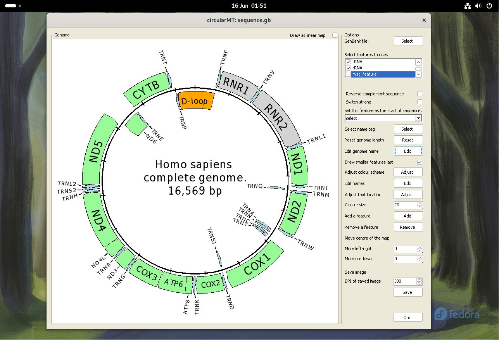

# Fedora Workstation 40:

## Starting point
Fedora Workstation 40 was installed on two 64 bit virtual machines with 4,096 MB of RAM, 4 processors. The VirtualBox virtual machine had a 25 GB hard disk while HyperV's virtual machine had a dynamically resizing hard disk. Both installations were installed using using the default setting and used the Gnome desktop.

The circularMT_64.exe file and the sequence.gb files were downloaded from the GitHub (https://github.com/msjimc/circularMT) 'Program' and 'Example data' folders to the user's Download folder using FireFox. 

## Installation

Wine was installed with the command:

> sudo dnf install wine

and the version determined to be wine 9.5 (Staging) for 32 and 64 bit versions with the following commands:

> wine --version     

and/or  

> wine64 --version   

and wine was configure with the following command:

> winecfg

## Installing Winetricks and a .Net runtime

Winetricks can be installed with the command:

>  sudo dnf install winetricks

and the the runtime installed with:

> winetricks -q dotnetdesktop6

for the .Net 6 runtime.

## Running circularMT.exe

 To run ```circularMT``` download the program from https://githud.com/msjimc/circularMT to your Downloads folder and issue the command below:

> wine ~/Downloads/circularMT.exe 

This will open the program which can be used as described in the [guide]( https://github.com/msjimc/circularMT/tree/master/Guide/README.md).

<hr />



Figure 1

<hr />