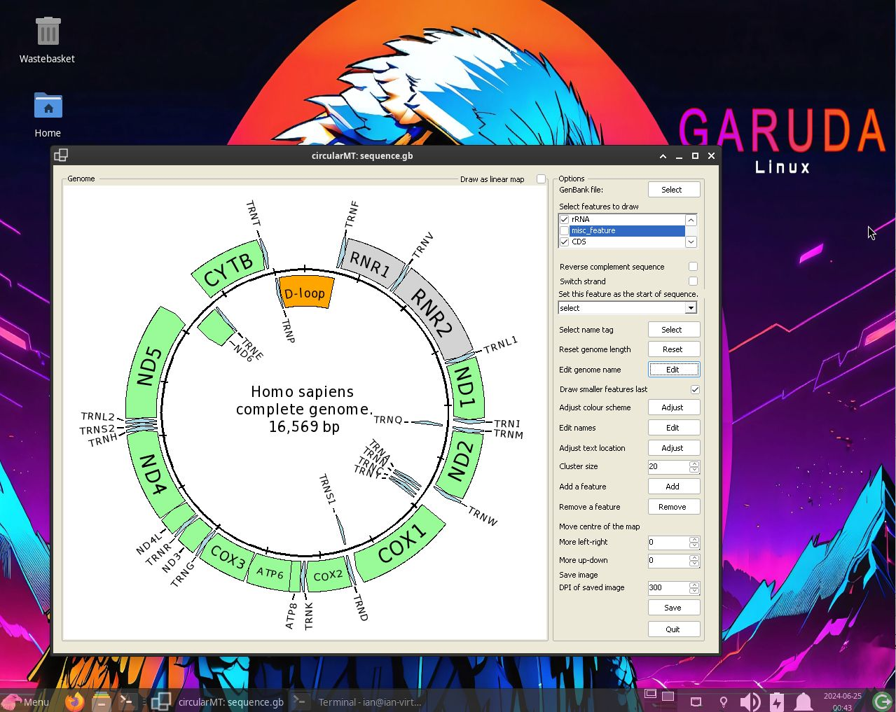

# Arch Linux:

## Starting point
Garuda 240428 - Xfce was installed on two 64 bit virtual machines with 4,096 MB of RAM, 4 processors. The VirtualBox virtual machine had a 40 GB hard disk while HyperV's virtual machine had a dynamically resizing hard disk. Both installations were installed with default settings and the Xfce desktop.

The circularMT.exe file and the sequence.gb files were downloaded from the GitHub (https://github.com/msjimc/circularMT) 'Program' and 'Example data' folders to the user's Download folder using FireFox. 

## Installation

It is recommended to do a full system update:

> sudo pacman -Syu

```Wine``` is then installed with the dependencies wine-mono and wine-gecko by:

> sudo pacman -S wine wine-mono wine-gecko

The installation and version can be checked with:
 
> wine --version

and/or 

> wine64 --version

with both commands stating wine 9.11 is installed.

The installation is configured with:

> winecfg

## Installing Winetricks and .Net runtime

Winetricks can be installed with the command:

> pacman -Syu winetricks

and the the runtime installed with:

> winetricks -q dotnetdesktop6

for the .Net 6 runtime. If the installation hangs try the command:

> rm -rf ~/.wine ; WINEDLLOVERRIDES="winegstreamer=" winecfg

and rerun winetricks -q dotnetdesktop6

## Running a Windows program like circularMT.exe

 To run ```circularMT``` download the program from https://githud.com/msjimc/circularMT to your Downloads folder and issue the command below:

> wine ~/Downloads/circularMT.exe 

This will open the program which can be used as described in the [guide]( https://github.com/msjimc/circularMT/tree/master/Guide/README.md).

<hr />



Figure 1

<hr />
