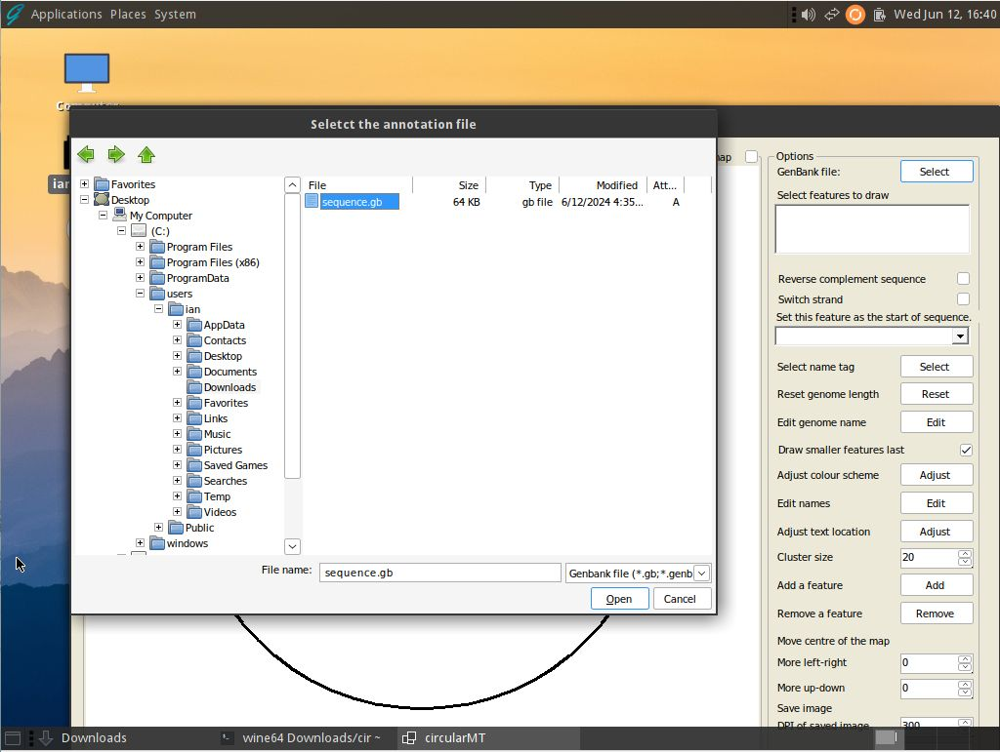
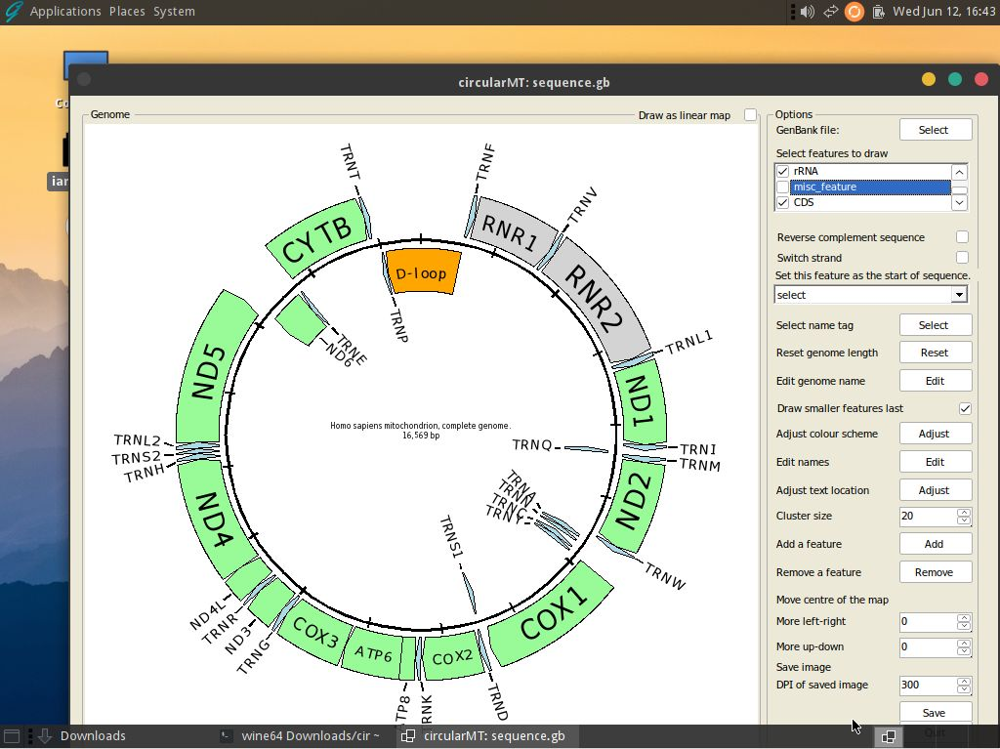

# GhostBSD 
GhostBSD 14.0-RELEASE was installed on a 64 bit virtual machine with 4,096 MB of RAM, 4 processors and a 20 GB hard drive on VirtualBox or  dynamically resizing hard disk with HyperV. The default desktop 'Mate' was installed.

The circularMT.exe file and the sequence.gb files were downloaded from the GitHub (https://github.com/msjimc/circularMT) 'Program' and 'Example data' folders to the user's Download folder using FireFox. 

## Preparation and installation

* **The account performing the installation must have admin rights.**

If you have admin rights elevate the terminal to raised privileges with:

> su -l root

and then enter root's password.

The FreeBSD web site contains instructions on how to install Wine [here](https://docs.freebsd.org/en/books/handbook/wine/). Since GhostBSD is based on FreeBSD the instructions should work here too. It suggests that you first install wine-gecko which contains web browser functions that some programs expect:

>pkg install wine-gecko

Next it suggests installing wine-mono which is needed to run .NET applications:

> pkg install wine-mono

Once these have been installed wine can be installed using:

> pkg install wine

The version of wine can then be determined with:

> wine64 --version

This installation installs wine64 which is the 64 bit version that requires 64 bit programs 


### Install 32-bit version of Wine

Once the 64  bit version of wine as been installed a script is saved in /usr/local/share/wine/ to install the 32 -bit version of wine using this command:

> /usr/local/share/wine/pkg32.sh install wine mesa-dri

The version of wine can then be determined with:

> wine --version 

This script installs wine32 version 9.0 which is the 32 bit version that requires 32 bit programs.

Finally, configure Wine with the following command:

> winecfg

If winecfg hangs, especially after you ran it for the wine64 install, but before the wine 32 bit install run:

> rm -R .wine 

and rerun

This will also download wine-mono if you didn't run the pkg install wine-mono step earlier.

## Installing Winetricks and .Net runtime

Winetricks can be installed with the command (as root):

>  pkg install winetricks

and the the runtime installed with:

> winetricks -q dotnetdesktop6

for the .Net 6 runtime.

## Running a Windows application like circularMT.exe

***Note:***  
GhostBSD will not run an application from a terminal using root privileges, so return to your normal account with ```Ctrl``` + ```D``` before running circularMT_64.exe with:

> wine ~/Downloads/circularMT.exe

This should start circular_64.exe after a configuration step that only occurs when wine is run for the first time (Figure 1).

<hr />



Figure 1: circularMT.exe running on GhostBSD - 24.04 with the default Mate desktop.

<hr />

Once imported, the mitochondrial genome can be modified as described in the [Guide](https://github.com/msjimc/circularMT/tree/master/Guide/README.md) Figure 2.

<hr />



Figure 2

<hr />
