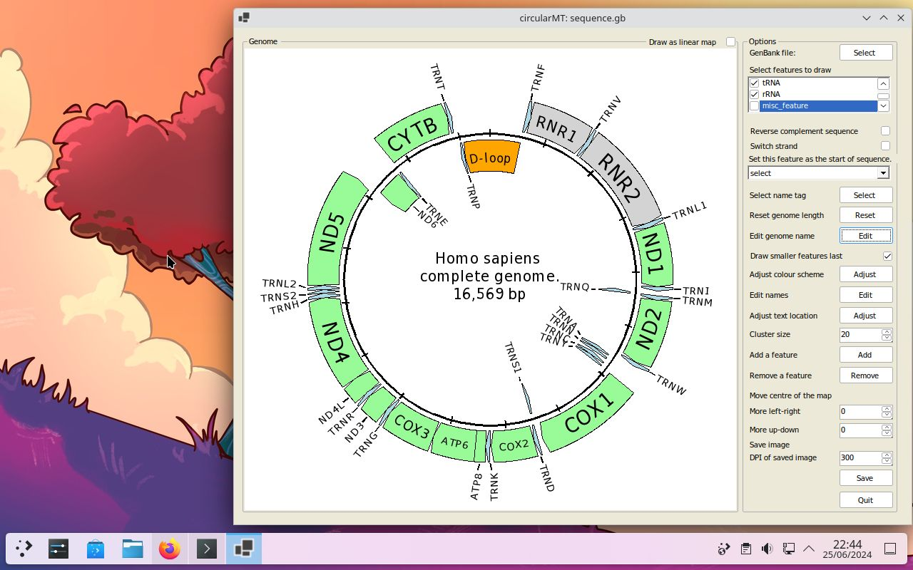

# KDE Neon:

## Starting point

KDE Neon (20240624-1012) was installed on a 64 bit virtual machine with 4,096 MB of RAM, 4 processors, with 40 GB hard disk (VirtualBox)  and was configured with the default settings and the KDE desktop. 

The circularMT.exe file and the sequence.gb files were downloaded from the GitHub (https://github.com/msjimc/circularMT) 'Program' and 'Example data' folders to the user's Download folder (~/Downloads) using FireFox.

## Preparation and installation

* **The account performing the installation must have admin rights.**

Wine can be installed either quickly via the [package manager](#quick-route), the [official way](#official-route) as suggested by Wine or via a slowly a series of [commands listed below](#install-wine-9). Since the quick route installs Wine version 6, the official route ,version 8 and the slow route version 9, it may be best to use the slower route.

### Install Wine 9 with apt and Wine download

Enable the 32 bit environment:  

> sudo dpkg --add-architecture i386

Install the Winehq repository key:  

> sudo mkdir -pm755 /etc/apt/keyrings  
> sudo wget -O /etc/apt/keyrings/winehq-archive.key https://dl.winehq.org/wine-builds/winehq.key

Get the required Wine files:

> sudo wget -NP /etc/apt/sources.list.d/ https://dl.winehq.org/wine-builds/ubuntu/dists/jammy/winehq-jammy.sources

Update the repository data:

> sudo apt update

Install missing packages

> sudo apt install libpoppler-glib8:{i386,amd64}=22.02.0-2ubuntu0.*

Get the Wine repository

> echo deb [signed-by=/usr/share/keyrings/winehq.gpg] http://dl.winehq.org/wine-builds/ubuntu/ jammy main | sudo tee /etc/apt/sources.list.d/winehq.list

Update the installation:

> sudo apt update

and then install Wine 

> sudo apt install winehq-stable --install-recommends 

Finally test the installation with:  

> wine --version

and 

> wine64 --version

Version 9 should be installed for both the 32 and 64 bit versions.

### Configure Wine

To configure Wine use:

> winecfg

This will prompt you to download the wine-mono package before opening a dialogue box this will allow you to perform more advanced tasks.

## Running a Windows program

To run circularMT, download it to the accounts Download folder from [here](https://github.com/msjimc/circularMT/Program) and start with this command in a terminal:

> wine ~/Downloads/circularMT.exe

This will start circularMT.exe which can be used as if it was on a Windows PC (Figure 5)

Figure 5

