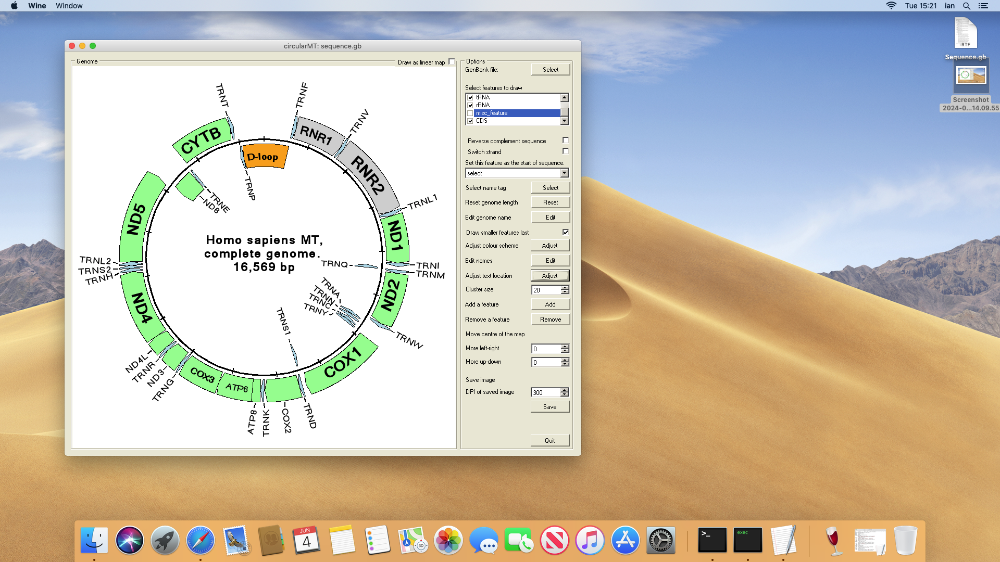

# macOS

Unlike various Linux installations, macOS cannot easily be run on a virtual machine. Therefore, Wine was installed on a 2012 Mac Mini running macOS Mojave 10.14.6. Wine was installed with the aid of XQuartz 2.7.7 by downloading the “Wine Stable” package from [here](https://dl.winehq.org/wine-builds/macosx/download.html) and clicking on the package in the Downloads folder. Newer versions of macOS (macOS Catalina 10.15.4 and later) install Wine using the “brew” application as described [here](https://wiki.winehq.org/MacOS).

Once Wine was installed, circularMT.exe was downloaded and started by clicking on it in the Downloads folder. When first used, Wine will run a configuration step, which may take a while, and also download wine-mono and wine-gecko before starting the Windows application (Figure 1).

Since Mojave 10.14 was released in 2014, it uses older packages and therefore installs Wine version 5.0. This is suitable for many programs, and newer versions of macOS will install newer versions of Wine.

Figure 1: circularMT.exe running on masOS (Mojave 10.14.6).

# Installation instructions on ___winehq.org___

## Install as a package
* https://wiki.winehq.org/MacOS

## Build from source code
* https://wiki.winehq.org/MacOS/Building

## Installing the .Net 6 runtime

Once Wine has been installed, download the required runtime from [here](https://dotnet.microsoft.com/en-us/download/dotnet/6.0) by selecting the appropriate Windows ***.NET Desktop Runtime 6.0.32*** file. If you want to install a newer version, such as 8 or 9, either search for desired version on Google or use the links at the top of the .Net 6 runtime page.

Once downloaded, double-click on the file, and the install dialogue box should open, allowing you to install it.