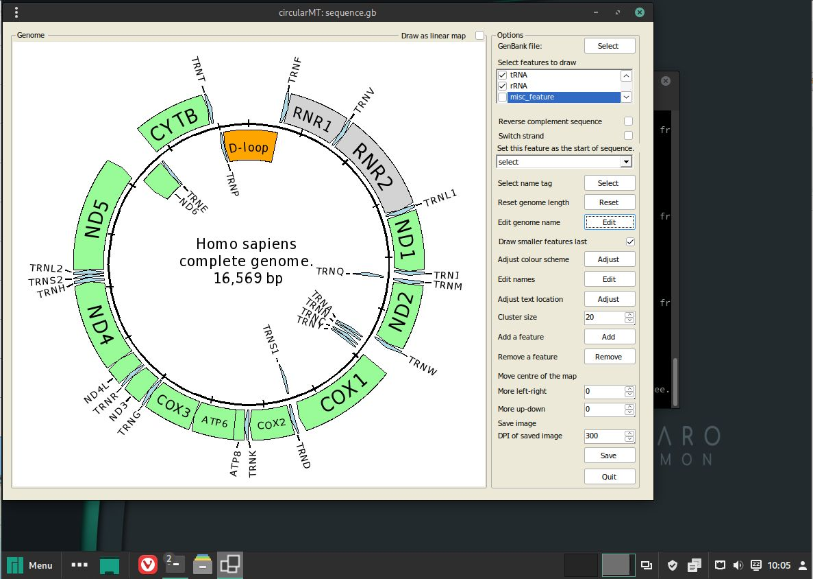

# Manjaro:

## Starting point
Manjaro-Cinnamon 23.0.1 was installed on two 64 bit virtual machines with 4,096 MB of RAM, 4 processors. The VirtualBox virtual machine had a 25 GB hard disk while HyperV's virtual machine had a dynamically resizing hard disk. Both installations were installed using the default settings and the Cinnamon desktop.

The circularMT.exe file and the sequence.gb files were downloaded from the GitHub (https://github.com/msjimc/circularMT) 'Program' and 'Example data' folders to the user's Download folder using Vivaldi.

***Note:*** Vivaldi is the default browser, but on these installations it had to be started using the ***Internet*** > ***Avahi VNC Server Browser*** option in the start menu .

## Installation

Manjaro is derived from Arch Linux and so the installation is almost the same except you don't need to edit the ***/etc/pacman.conf*** and there doesn't seem to be an issue with the winecfg step hanging.

Before installing it is then recommended to do a full system update:

> sudo pacman -Syu

```Wine``` is installed with the dependencies wine-mono and wine-gecko by:

> sudo pacman -S wine wine-mono wine-gecko

The installation and version can be checked with:
 
> wine --version

and/or 

> wine64 --version

with both commands stating wine 9.9 is installed.

The installation is configured with:

> winecfg

Unlike the other installations, because I downloaded and installed wine-mono, winecfg will not ask to install it.

## Installing the .Net runtime

The .Net 6 runtime can be installed by downloading the runtime installer from [here](https://dotnet.microsoft.com/en-us/download/dotnet/6.0) selecting the appropriate Windows ***.NET Desktop Runtime 6.0.32*** file. This is then installed with:

> wine ~/Downloads/windowsdesktop-runtime-6.0.32-win-x64.exe

***Note*** It is also possible to install the current .Net 8 and the preview .Net 9 versions by downloading and installing the required file.


## Running circularMT.exe

 To run ```circularMT``` download the program from https://githud.com/msjimc/circularMT to your Downloads folder and issue the command below:

> wine ~/Downloads/circularMT.exe 

This will open the program which can be used as described in the [guide]( https://github.com/msjimc/circularMT/tree/master/Guide/README.md).

<hr />



Figure 1

<hr />
