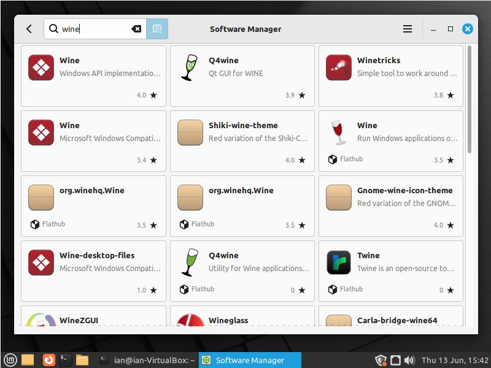
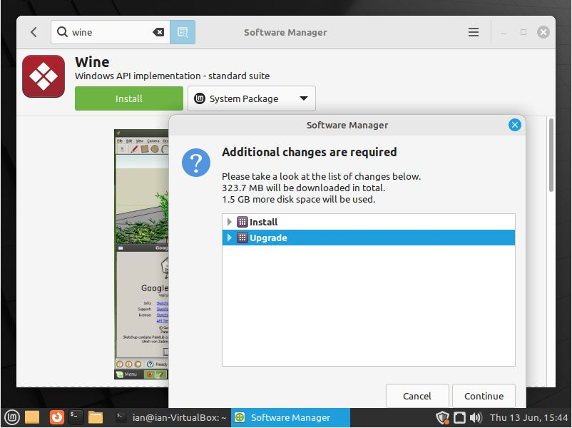
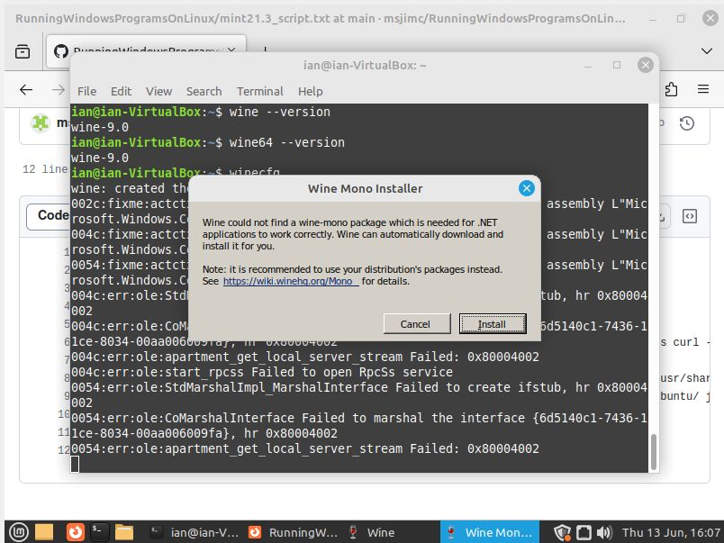
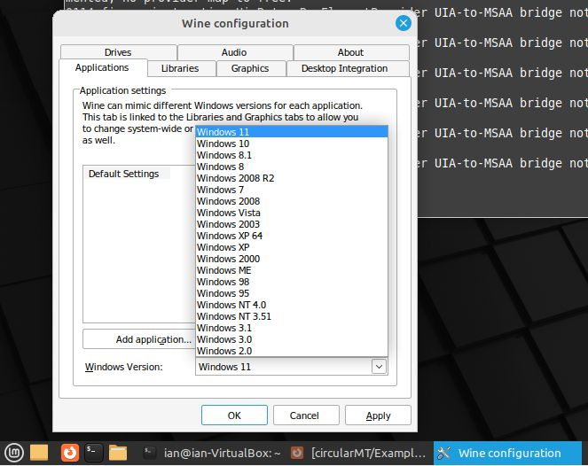
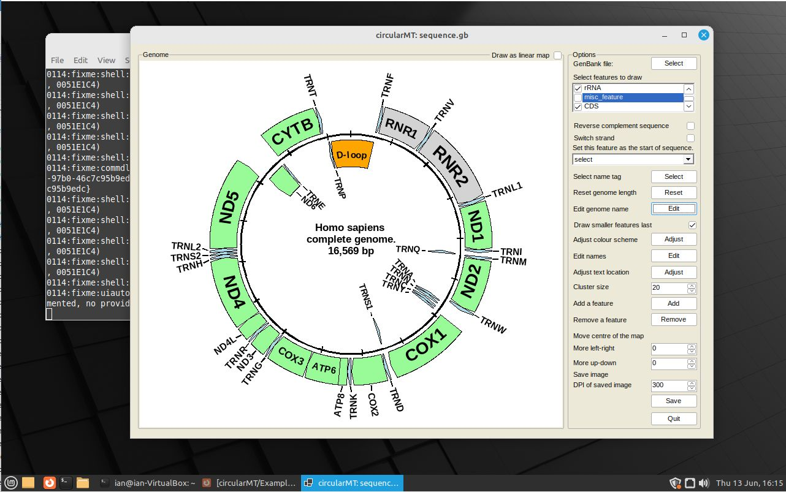

# Mint 21.3 "Virginia" with the Mate desktop

## Starting point

Mint 21.3 "Virginia" was installed on a 64 bit virtual machine with 4,096 MB of RAM, 4 processors, with 40 GB hard disk (VirtualBox). It was configured with the default settings. The chosen ISO image was pre-configured to use the Mate Desktop.

***Note:*** Mint 21.3 can not be installed on Hyper-V so only the virtualbox installation was tested.

The circularMT.exe and the sequence.gb files were downloaded from the GitHub (https://github.com/msjimc/circularMT) 'Program' and 'Example data' folders to the user's Downloads folder (~/Downloads) using Firefox.

## Preparation and installation

* **The account performing the installation must have admin rights.**

Wine can be installed either quickly via the [package manager](#quick-route), which installs Wine version 6, or more slowly via a series of [commands listed below](#install-wine-9), which installs Wine version 9. Since the slower method installs a newer version, it may be best to use that route.

### Quick route 

Open the Package manager and search for ***wine*** (Figure 1)



Figure 1

<hr />

Click on the first Wine package and install by pressing the ```Continue``` button (Figure 2)



Figure 2

<hr />


Test the version with:

> wine --version

and 

> wine64 --version

Both commands should suggest version 6 is installed.

### Install Wine 9 with apt and Wine download

First update Mint (optional) with:

> sudo apt update  
> sudo apt upgrade

Update the repository setting with:  

> sudo apt install dirmngr ca-certificates software-properties-common apt-transport-https curl -y

Next enable the 32 bit environment:  

> sudo dpkg --add-architecture i386

Install the GPG key:  

> curl -s https://dl.winehq.org/wine-builds/winehq.key | sudo gpg --dearmor | sudo tee /usr/share/keyrings/winehq.gpg > /dev/null

Get the Wine repository:

> echo deb [signed-by=/usr/share/keyrings/winehq.gpg] http://dl.winehq.org/wine-builds/ubuntu/ jammy main | sudo tee /etc/apt/sources.list.d/winehq.list

Update the installation:

> sudo apt update

Then install Wine:

> sudo apt install winehq-stable --install-recommends 

Finally, test the installation with:  

> wine --version

and 

> wine64 --version

Version 9 should be installed for both the 32-bit and 64-bit versions.

### Configure Wine

To configure Wine use:

> winecfg

When the first dialogue box appears, install Wine-Mono (Figure 3)
and finally select the version of Windows you wish to emulate using the options at the bottom of the ```Wine configuration``` form (Figure 4).



Figure 3

<hr />



Figure 4

<hr />


## Installing Winetricks and .NET runtime

Winetricks can be installed with the command (as root):

>  sudo apt-get install winetricks

The  runtime can be installed by downloading the runtime installer from [here](https://dotnet.microsoft.com/en-us/download/dotnet/6.0), selecting the appropriate file from the  ***.NET Desktop Runtime 6.0.32*** section. This is then installed with:

> wine ~/Downloads/windowsdesktop-runtime-6.0.32-win-x64.exe

***Note*** It is also possible to install the current .NET 8 and the preview .NET 9 versions by downloading and installing the required file.


## Running a Windows program

To run circularMT, download it to the account's Downloads folder from [here](https://github.com/msjimc/circularMT/Program) and start it with this command in a terminal:

> wine ~/Downloads/circularMT.exe

This will start circularMT.exe, which can be used as if it were on a Windows PC (Figure 5)



Figure 5

<hr />