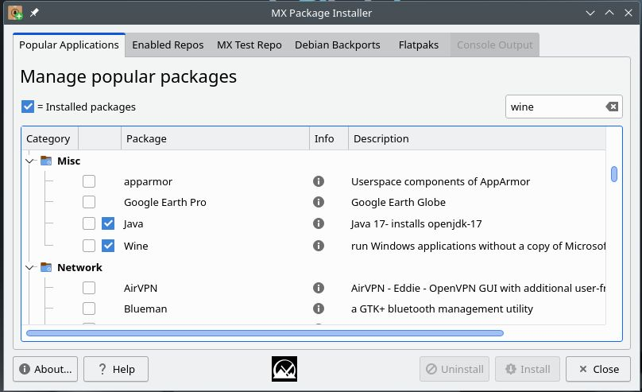
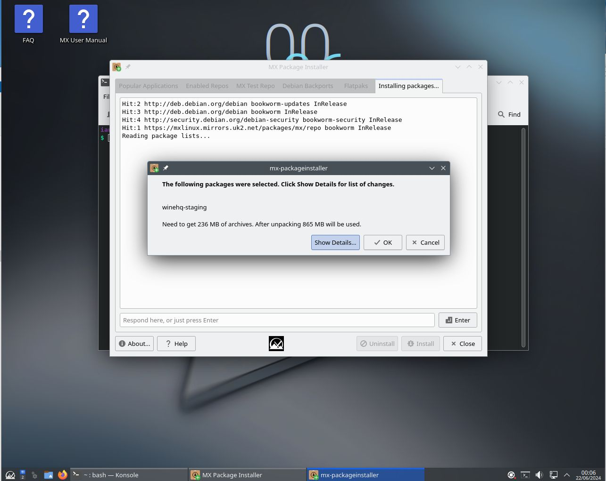
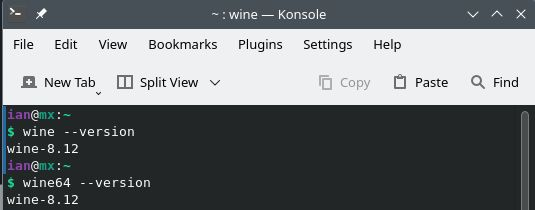
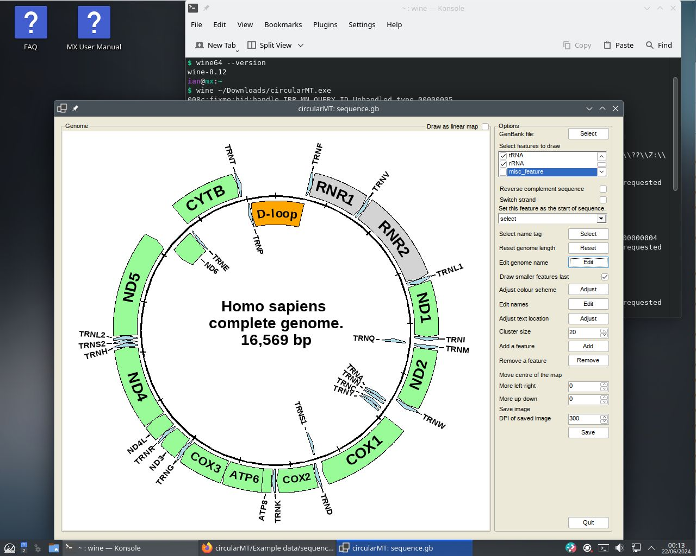

# MX Linux 
MX Linux 23.3 KDE was installed on a 64 bit virtual machine with 4,096 MB of RAM, 4 processors. VirtualBox used a 20 GB hard disk while HyperV used a dynamically resizing hard disk. Both installations were configured with default settings with the Xfce desktop.

The circularMT.exe file and the sequence.gb file were downloaded from the GitHub (https://github.com/msjimc/circularMT) 'Program' and 'Example data' folders to the user's Download folder (~/Downloads) using FireFox.

## Preparation and installation

* **The account performing the installation must have admin rights.**

The ```MX package Installer``` app was opened and the term: ***Wine*** was enter in the upper right hand text area. Initially, a single entry for Wine appeared before the other packages were added to the list. In the larger list, Wine can be found under the Misc subset (Figure 1). Checking Wine and pressing the Install button installed ```wine``` and ```wine64``` (Figure 1). The installation imported the required wine-mono file and also ran the winecfg configuration step (Figure 2).

<hr />



Figure 1

<hr />



Figure 2

<hr />

A terminal was opened and the installation checked (Figure 2) by entering the command: 

>  wine --version  

that indicated that Wine 8.12 was installed. 

<hr />



Figure 3

<hr />

## Installing Winetricks and .Net runtime

Winetricks can be installed with the command (as root):

>  sudo apt-get install winetricks

and the the runtime installed via Winetricks with:

winetricks -q dotnetdesktop6

## Using Wine to run a Windows .Net program

```Wine``` was then used to run the .Net application circularMT with the following command:

> wine ~/Downloads/circularMT.exe


Once running, data can be imported as described in the [Guide](https://github.com/msjimc/circularMT/tree/master/Guide/README.md). While circularMT is running on MX Linux, the file system will appear like a Windows based system rather than a Linux file system. While the user's Download folder is in /home/username/Downloads on MX Linux it appears to be in c:/users/<username>/Downloads/ to programs running with Wine. Once imported, the mitochondrial genome can be modified as described in the [Guide](https://github.com/msjimc/circularMT/tree/master/Guide/README.md) Figure 34.

<hr />



Figure 4

<hr />

