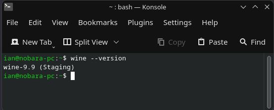
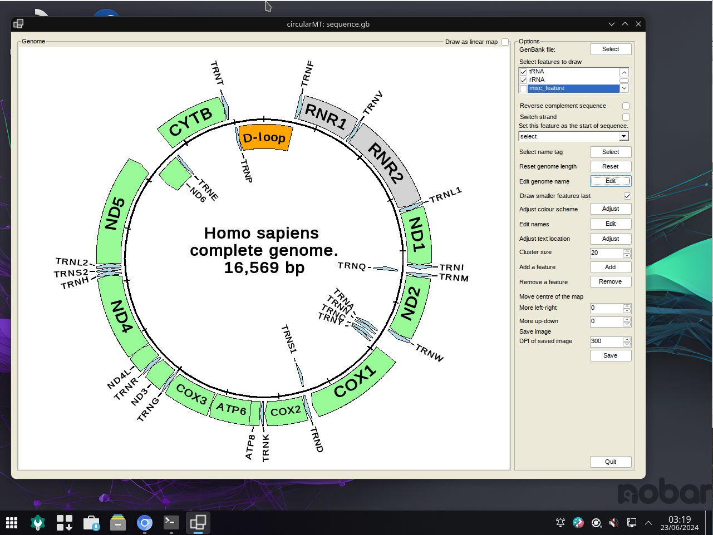

# Nobara: 
Nobara 39 - Official (2024-01-24) was installed on a 64 bit virtual machine with 4,096 MB of RAM, 4 processors. VirtualBox used a 20 GB hard disk while HyperV used a dynamically resizing hard disk. Both installations were configured with default settings with the KDE desktop.

The circularMT_64.exe file and the sequence.gb file were downloaded from the GitHub (https://github.com/msjimc/circularMT) 'Program' and 'Example data' folders to the user's Download folder (~/Downloads) using Chromium.

## Installation

When first installed, Nobara has Wine 8.2 (Staging) installed. After the strongly advised system update, Wine was upgraded to wine 9.9 (Staging) (Figure 1)

<hr />



Figure 1

<hr />

While Wine is preinstalled it is not configured and so requires winecfg to be run to download and install wine-mono:

> winecfg

## Running circularMT.exe

 To run ```circularMT``` download the program from https://githud.com/msjimc/circularMT to your Downloads folder and issue the command below:

> wine ~/Downloads/circularMT.exe 

This will open the program which can be used as described in the [guide]( https://github.com/msjimc/circularMT/tree/master/Guide/README.md).

<hr />



Figure 1

<hr />
