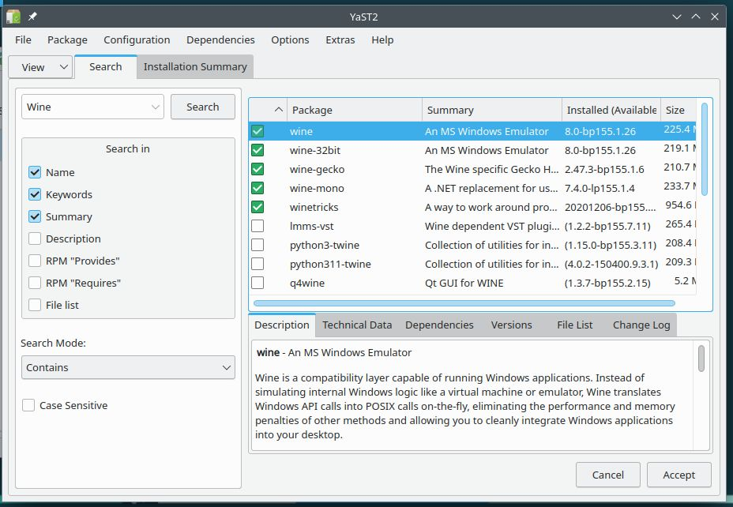
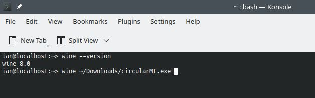
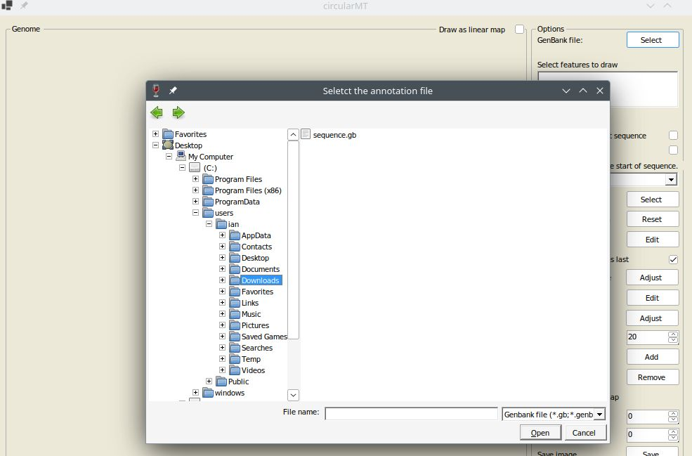
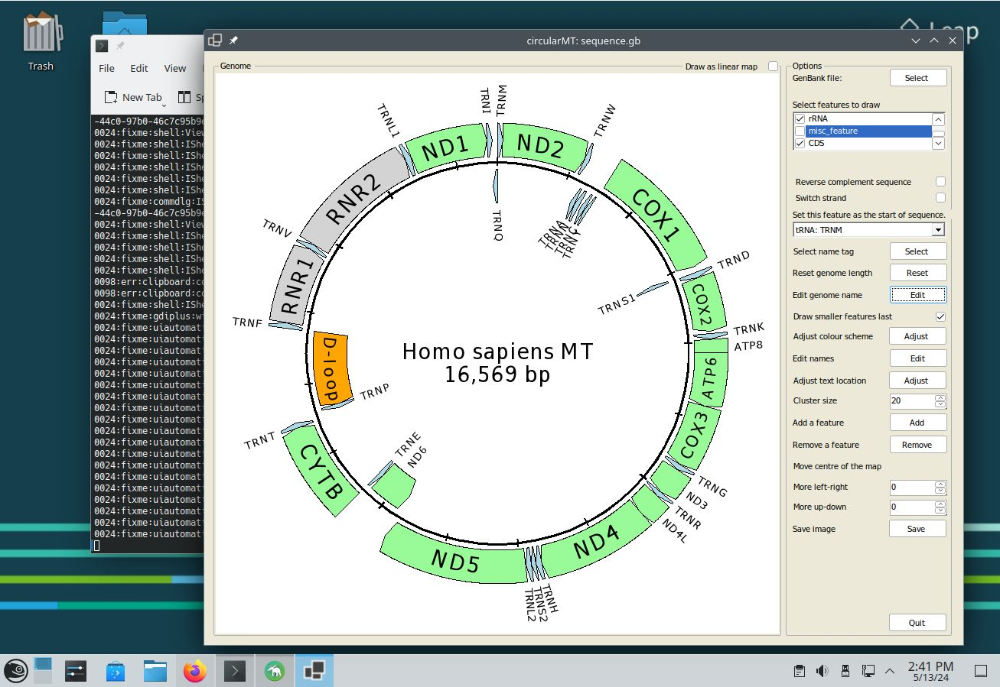

# openSUSE:

## Starting point

OpenSUSE - 'Leap' 15.5 was installed on a 64 bit virtual machine with 4,096 MB of RAM, 4 processors. The installation on VirtualBox used a 20 GB hard disk while the installation on HyperV used a dynamically resizing hard disk. Both installations were installed with default settings with the KDE desktop.

The circularMT.exe file and the sequence.gb files were downloaded from the GitHub (https://github.com/msjimc/circularMT) 'Program' and 'Example data' folders to the user's Download folder (~/Downloads) using FireFox.

## Preparation and installation

* **The account performing the installation must have admin rights.**

YaST was started from the application launcher and the ```Software Management``` option selected. The repositories were search using wine as a search term and from the list of hits ***Wine***, ***wine-32bit***, ***wine-gecko***, ***wine-mono*** and ***winetricks*** were selected and installed (Figure 1). 

<hr />



Figure 1

<hr />

A terminal was opened and the installation checked by entering 

>$  wine --version 

This reported the installed version is version 8.0 (Figure 2)

<hr />



Figure 2: The openSUSE package manager installs wine version 8 which is sufficient for circularMT.

<hr />

Finally, the installation was configured with the command:

> winecfg

## Installing Wine 9.13 via the command line

First get the repository key and install it with:

> wget https://download.opensuse.org/repositories/Emulators:/Wine/15.5/repodata/repomd.xml.key  
> sudo rpm --import repomd.xml.key

Add the Wine repository:

> sudo zypper addrepo https://download.opensuse.org/repositories/Emulators:/Wine/15.5/Emulators:Wine.repo

Refresh the package database

> sudo zypper refresh  

Install Wine with:

sudo zypper install wine

This will install Wine 9.13

And finally configure wine with 

> winecfg.

## Installing Winetricks and .Net runtime

Winetricks can be installed with the command (as root):

>  sudo zypper install winetricks

and the the runtime installed by downloading the runtime installer from [here](https://dotnet.microsoft.com/en-us/download/dotnet/6.0) after selecting the appropriate Windows ***.NET Desktop Runtime 6.0.32*** file. This is then installed with:

> wine ~/Downloads/windowsdesktop-runtime-6.0.32-win-x64.exe

***Note*** It is also possible to install the current .Net 8 and the preview .Net 9 versions by downloading and installing the required file.

## Running a Windows program such as circularMT

```Wine``` was then used to run circularMT with the following command:

> wine ~/Downloads/circularMT.exe

When first run, ```Wine``` may undergo a configuration step if winecfg has not been run, before displaying the circularMT interface (Figure 3). It may also fail to run circularMT stating that wine-mono isn't installed this can be installed following the instructions [here (wine-mono-is-missing)](READMe.md#wine-mono-is-missing).

Once running, data can be imported as described in the [Guide](https://github.com/msjimc/circularMT/tree/master/Guide/README.md). While circularMT is running on openSUSE, the file system will appear like a Windows based system rather than a Linux file system (Figure 3). While the user's Download folder is in /home/username/Downloads on openSUSE it appears to be in c:/users/\<username>/Downloads/ to circularMT.

<hr />



Figure 3

<hr />

Once imported, the mitochondrial genome can be modified as described in the [Guide](https://github.com/msjimc/circularMT/tree/master/Guide/README.md) Figure 4.

<hr />



Figure 4

<hr />

