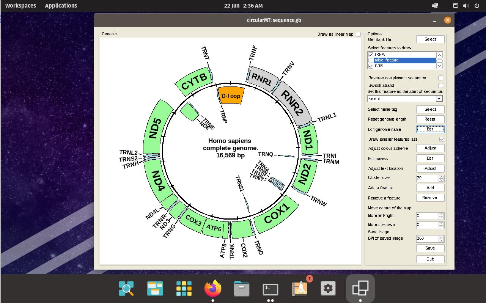

# POP!_OS:

## Starting point
POP!OS 22.04 was installed on a 64 bit virtual machine with 4,096 MB of RAM, 4 processors and on VirtualBox with 25 GB hard disk while on HyperV it had a dynamically resizing hard disk. Both installations were configured with default settings and the gnome desktop.

The circularMT.exe file and the sequence.gb files were downloaded from the GitHub (https://github.com/msjimc/circularMT) 'Program' and 'Example data' folders to the user's Download folder using FireFox. 


## Installation

Initially, ```Wine``` was installed using the ***apt*** package installation tool with the command:

> sudo apt wine

however this only installed ```Wine``` version 6.0. Consequently since POP!_OS is based on Ubuntu - Jammy, Wine was installed using the guide on Wine's web page for [Ubuntu Jammy](https://wiki.winehq.org/Ubuntu).  Initially, the system was prepared for 32 bit applications by entering the following command in a terminal:

> sudo dpkg --add-architecture i386 

Next the required repository was added:

> sudo mkdir -pm755 /etc/apt/keyrings  
> sudo wget -O /etc/apt/keyrings/winehq-archive.key https://dl.winehq.org/wine-builds/winehq.key

followed by the required source locations. For Ubuntu Noble Numbat 24.04 the command is:

> sudo wget -NP /etc/apt/sources.list.d/ https://dl.winehq.org/wine-builds/ubuntu/dists/jammy/winehq-jammy.sources

Finally ```Wine``` was installed using:

> sudo apt install --install-recommends winehq-stable

Wine was then configured and linked to the wine-mono file by running winecfg:

> winecfg

This prompts the user to download and install wine-mono via a dialogue box.

## Check the installation

The following commands:

> wine --version  

and 

> wine64 -- version

revealed that wine 9.0 had been installed.

## Running Windows applications such as circularMT.exe

 To run ```circularMT``` download the program from https://githud.com/msjimc/circularMT to your Downloads folder and issue the command below:

> wine ~/Downloads/circularMT.exe 

Once started, circularMT can be used as if it were on a Windows PC (Figure 1).

<hr />



Figure 1

<hr />
