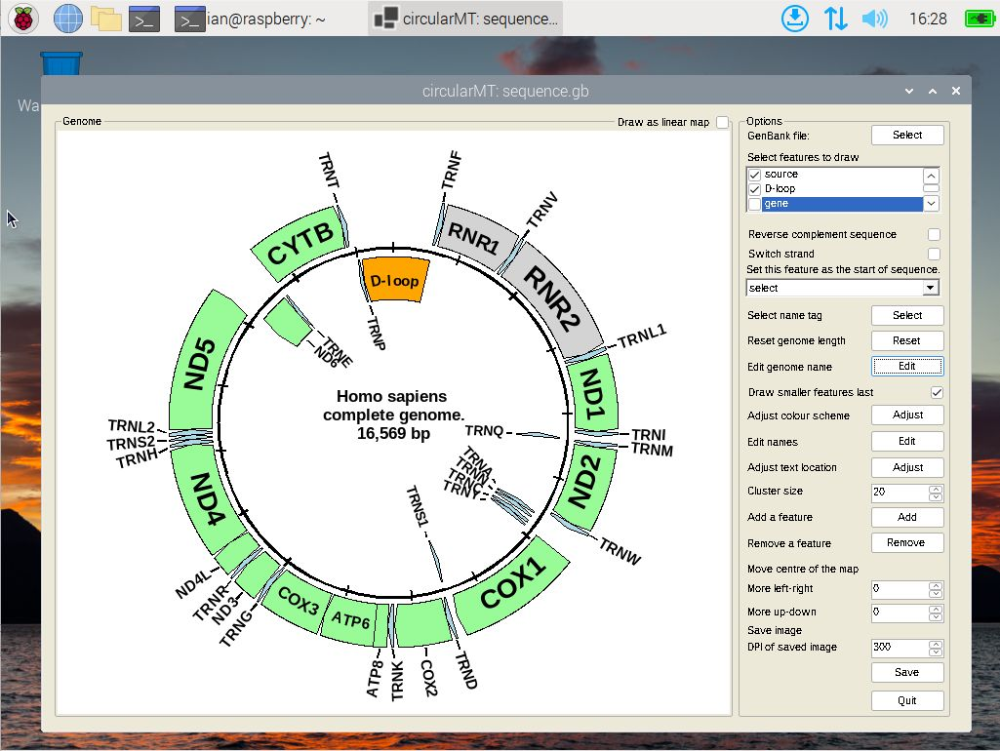

# Raspberry Pi Desktop 

Raspberry Pi Desktop is the x86 adaptation of Raspberry Pi OS (formerly Raspbian), which traditionally runs on ARM processors. Both operating systems are derivatives of Debian Bullseye, offering a user experience reminiscent of the Raspberry Pi environment, despite not being the original Raspberry Pi hardware.

The specific build used, 2022-07-01-raspios-bullseye-i386.iso, was set up on a 64-bit virtual machine equipped with 4,096 MB of RAM and 4 CPU cores. For storage, VirtualBox was assigned a 20 GB hard disk, while Hyper-V utilized a dynamically resizing hard disk. Both installations adhered to the default configuration settings and featured the PIXEL desktop environment.

The circularMT_64.exe and the sequence.gb files were downloaded from the 'Program' and 'Example data' directories of its [GitHub repository](https://github.com/msjimc/circularMT) to the user's Downloads folder (~/Downloads) using Firefox.

## Preparation and installation

* **The account performing the installation must have admin rights.**

Unlike the Debian installation that used the package manager, its recommended to follow the [WineHQ install method](https://wiki.winehq.org/Debian) for Debian to install Wine 9.0 as follows.  

First set the architecture to support 32-bit programs

> sudo dpkg --add-architecture i386 

Then, add the WineHQ repository key:

> sudo mkdir -pm755 /etc/apt/keyrings   
> sudo wget -O /etc/apt/keyrings/winehq-archive.key https://dl.winehq.org/wine-builds/winehq.key

Next, Download the source files for Debian Bullseye:

> sudo wget -NP /etc/apt/sources.list.d/ https://dl.winehq.org/wine-builds/debian/dists/bullseye/winehq-bullseye.sources

Install the stable version of Wine:

> sudo apt install --install-recommends winehq-stable

Finally, run winecfg to configure Wine and install wine-mono when prompted:

> winecfg

## Installing Winetricks and .Net 6 (or above)

Winetricks is install with:

>sudo apt install install-recommends winetricks

To install the .NET 6 runtime, download the ***x86*** .NET 6 runtime (or versions 8 or 9) from  [.NET download page]
(https://dotnet.microsoft.com/en-us/download/dotnet/6.0), selecting the appropriate ***Windows*** 64-bit version from the __.NET Desktop Runtime 6.0.32__ section. Install the runtime with the command (the runtime file name may differ):

> wine windowsdesktop-runtime-6.0.32-win-x86.exe

A dialogue box will open and prompt you to install the runtime. Since this installs the 32 bit version of the runtime, it is necessary to download 32 bit programs and not 64 bit programs or .NET programs compiles with the 'AnyCPU' option.

## Running a window application like circularMT

circularMT can be run with the aid of Wine by executing the following command in the terminal:

> wine ~/Downloads/circularMT.exe

Once running, it is user as if it were on a Windows computer as described in the [Guide](https://github.com/msjimc/circularMT/tree/master/Guide/README.md) (Figure 1). 

Figure 1

