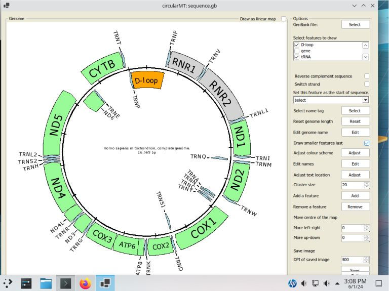

# SlackWare 15.0_RELEASE

## Starting point

OpenSUSE - 'Leap' 15.5 was installed on a 64 bit virtual machine with 4,096 MB of RAM, 4 processors, VirtualBox: 40 GB hard disk or HyperV: dynamically resizing hard disk and was configured with the default settings (the hard disk was GPT formatted with partition of: 600M EFI boot, 4 G Linux swap partition and a 35.4 G Linux file system set using cfdisk) and configured to use the KDE5 desktop.

Note: VirtualBox was configured with EFI enabled and was of type: Linux and version: Oriacle Linux (64-bit)

The circularMT_64.exe file and the sequence.gb files were downloaded from the GitHub (https://github.com/msjimc/circularMT) 'Program' and 'Example data' folders to the user's Download folder (~/Downloads) using FireFox.

## Preparation and installation

* **The account performing the installation must have admin rights.**

Log in as root, the wine-9.9-x86_64-1sg.txz file was downloaded from https://sourceforge.net/projects/wine/files/Slackware%20Packages/9.9/x86_64/ to root's Downloads folder and wine installed with:

> sudo -i upgradepkg --install-new ~/Downloads/wine-9.9-x86_64-1sg.txz

This installed wine64 version 9.9 which was configured for each user with the command:

> wine64 winecfg

circularMT_64.exe was then run with the command:

> wine64 ~/Downloads/circularMT_64.exe (figure 1)

Figure 1

 
