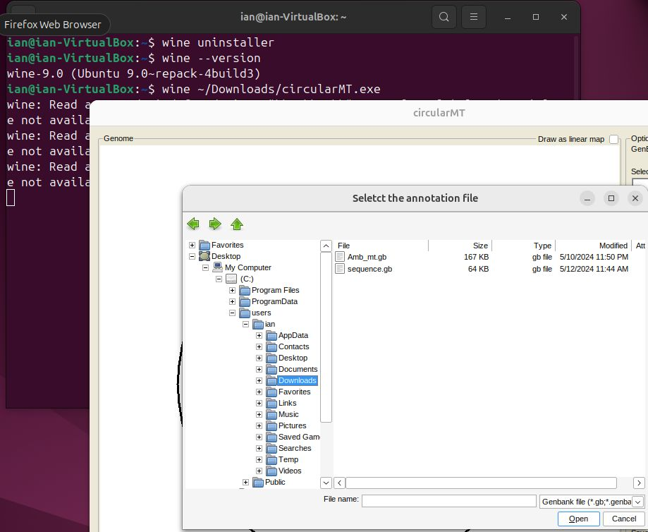

# Ubuntu:

## Starting point
Ubuntu ‘Noble Numbat’ 24.04 was installed on a 64-bit virtual machine with 4,096 MB of RAM and 4 processors. On VirtualBox, a 40 GB hard disk was allocated, while Hyper-V was configured with a dynamically resizing hard disk. Both installations were set up with the default settings and the Gnome desktop environment.

The circularMT.exe file and sequence.gb files were downloaded from the ‘Program’ and ‘Example data’ sections of the [circularMT GitHub repository](https://github.com/msjimc/circularMT). These files were saved to the user’s Download folder using the Firefox browser.

## Preparation

### Download the required wine-mono

* wine-mono: Ensure you check the [wine-mono official page](https://wiki.winehq.org/Mono) for the required version, which is available as a prebuilt binaries from [here](https://dl.winehq.org/wine/wine-mono/). Download the *.msi file so that it can be linked to wine after the installation.

## Installation

Wine was successfully installed on Ubuntu following the steps outlined in the official Wine [installation guide](https://wiki.winehq.org/Ubuntu).  Initially, the system was prepared for 32-bit applications by entering the following command in a terminal:

> sudo dpkg --add-architecture i386 

Next, the winehq repository key was added:

> sudo mkdir -pm755 /etc/apt/keyrings  
> sudo wget -O /etc/apt/keyrings/winehq-archive.key https://dl.winehq.org/wine-builds/winehq.key

The required source files were downloaded by executing the following command:

> sudo wget -NP /etc/apt/sources.list.d/ https://dl.winehq.org/wine-builds/ubuntu/dists/noble/winehq-noble.sources

***Note:***  For different versions of Ubuntu or Mint, please refer to the Wine website to locate the corresponding source files. 

The final stage of the installation process was to install Wine using the command:

> sudo apt install --install-recommends wine-stable

Verify the installed version of Wine:

> wine --version

 or

> wine64 --version

The output should confirm that Wine 9.0 is installed.

### Issues

***Note***:  As of May 2024, the official documentation recommends the winehq-stable package. This appears to be a typographical error. The correct package name is wine-stable.

## Linking the wine-mono file to wine

When wine has been installed run the following command:

> wine uninstaller

This command opens the Add/Remove Programs window. To install additional components such as Wine Mono, follow these steps:

 * Click the Install button.   
 * Navigate to and select the wine-mono file.
 * Click OK to proceed with the installation

The association of wine-mono to Wine may take a while, so do not close the form straight away. 
Close and reopen the ```Add/Remove Programs``` window and it should now display the ***Wine Mono Runtime*** and ***Wine Mono Windows Support*** in the lower panel (Figure 1).

<hr />


Figure 1

<hr />

## Check the installation

Run the following command:

> wine --version  

This should tell you what version of wine you have, if you also get a message that wine32 is missing see the next section other wise go to the 

### "wine32 is missing"

If you get a message like:

> it looks like wine32 is missing, you should install it.  
as root, please execute "apt-get install wine32"

***Note***: If your message mentions wine32:i386 or similar, ignore the text after the ":" carry on as described.

Open the ```Software and Updates``` app and change the ***Subscribe to:*** option to ***Security and recommended updates***, then enter your (admin) password (possibly several times) and reload the information as requested (Figure 2).  

<hr />


Figure 2

<hr />

Once the option has been changed execute this command:

> sudo apt-get install wine32

Once installed you can change the ***Subscribe to:*** option back to its original value.
 
## Installing Winetricks and the .NET 6 runtime

### Winetricks is install using the command:

> sudo apt install --install-recommends winetricks

### Installing the  .NET 6 runtime:

The standard Wine prefix created by winecfg command will not work and so you need to create a 32-bit Wine prefix with:

> WINEPREFIX="$HOME/.win32" WINEARCH=win32 wine wineboot

To install the the runtime download the runtime ***x86*** installer from the __.NET Desktop Runtime 6.0.32__ section on this [.NET 6 Runtime download page](https://dotnet.microsoft.com/en-us/download/dotnet/6.0) and install it with:

>  WINEPREFIX="$HOME/win32" wine  ~/Downloads/windowsdesktop-runtime-6.0.32-win-x86.exe 

If the program is a .NET application built with the 'Any CPU' option it may not run in which case try the binaries compiled specifically for a x86 OS. For instance [AgileStructure](https://github.com/msjimc/AgileStructure/tree/master/program) contains the 'Any CPU' binaries (*.exe, *.dll and *.json) which run on many of the installation covered in the repository, but will not run on Ubuntu, but the binaries in the AgileStructure_x86 subfolder will run in the 32 bit environment (see below).

## Running a Windows application

### Non-.NET programs and those using the 2.x to 4.x .NET framework e.g. circularMT

 To run ```circularMT``` download the program from https://githud.com/msjimc/circularMT to your Downloads folder and issue the command below:

> wine ~/Downloads/circularMT.exe 

The first time it runs you may have to wait while wine runs a configuration script if you did not configure Wine with winecfg. If this displays a dialogue window in German click the left hand button to accept. If Wine is correctly install circularMT show appear as shown in Figure 3. This 'loading' step may display a number of warning and error messages which can be ignored unless the terminal displaces a command prompt and circularMT isn't loaded.

<hr />


Figure 3

<hr />

Pressing the ```Select``` button allows you to import a file, as with centOS, Debian and openSUSE, the paths displayed by circularMT/Wine are in the Windows format and not the Linux style (Figure 4).

<hr />



Figure 4

<hr />

Once imported, the image of the mitochondrial genome can be modified as described in the [Guide](../Guide/README.md) (Figure 5).

<hr />


Figure 5

<hr />

### Programs requiring the .NET 6-9 runtimes e.g. AgileStructure

The three files required for AgileStructure can be downloaded from [here](https://github.com/msjimc/AgileStructure/tree/master/program/AgileStructure_x86). These have been compiled with the 'x86' option. These programs require the .NET runtime installed in a 32 - bit Wine Prefix whose creation was described in the previous installation section.

Run a program with a non-default Wine prefix with:

>  WINEPREFIX="$HOME/win32" wine ~/Downloads/AgileStructure.exe