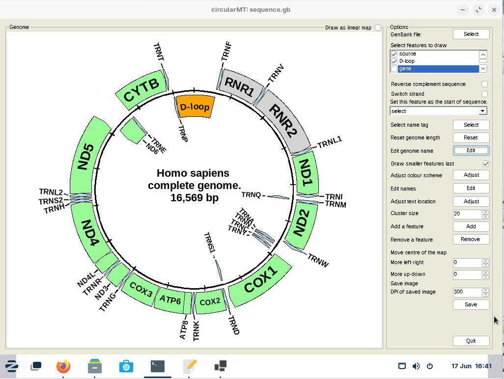

# Zorin 17 core

## Starting point
Zorin core 17 was installed on a 64 bit virtual machine with 4,096 MB of RAM, 4 processors and on VirtualBox with 25 GB hard disk while on HyperV it had a dynamically resizing hard disk. Both installations were configured with default settings and the default Gnome desktop.

The circularMT.exe file and the sequence.gb files were downloaded from the GitHub (https://github.com/msjimc/circularMT) 'Program' and 'Example data' folders to the user's Download folder using FireFox. 

## Installation

Zorin core 17 is derived from Ubuntu Jammy so the installation is similar to the Ubuntu installation.  Initially, the system was prepared for 32 bit applications by entering the following command in a terminal:

> sudo dpkg --add-architecture i386 

Next the required repository was added:

> sudo mkdir -pm755 /etc/apt/keyrings  
> sudo wget -O /etc/apt/keyrings/winehq-archive.key https://dl.winehq.org/wine-builds/winehq.key

followed by the required source locations. For Ubuntu Noble Numbat 24.04 the command is:

> sudo wget -NP /etc/apt/sources.list.d/ https://dl.winehq.org/wine-builds/ubuntu/dists/jammy/winehq-jammy.sources

***Note:*** This is different from the Ubuntu file, if you used the latest Ubuntu version you will install Wine 6.0.

Update the package information:

> sudo apt update

Finally ```Wine``` was installed using:

> sudo apt install --install-recommends winehq-stable

Check the version with:

> wine --version

 or

> wine64 --version

which should be 9.0.

```Wine``` is configured with:

> winecfg

This will prompt you to install the wine-mono file which you should do and finally show the Wine configuration dialogue window with which you can set the Windows version if desired.

## Installing Winetricks and the .Net 6 runtime

Winetricks is install using the command:

> sudo apt install --install-recommends winetricks

Install the  .Net 6 runtime with:

> winetricks -q dotnetdesktop6

Its important to read the first few lines to see if it states you are using a 32 bit WinePrefix or you get an error message stating you need to install the .Net runtime you may need to make a 32 bit specific Wine prefix using:

> WINEPREFIX="$HOME/.win32" WINEARCH=win32 wine wineboot

To install the the runtime in the 32 bit Wine prefix download the runtime install file, download the runtime x86 install file from the __.NET Desktop Runtime 6.0.32__ section on this [page](https://dotnet.microsoft.com/en-us/download/dotnet/6.0) and install it with:

>  WINEPREFIX="$HOME/.win32" wine  ~/Downloads/windowsdesktop-runtime-6.0.32-win-x86.exe 

If the program is a .Net application built with the 'Any CPU' option it may not run in which case try the binaries compiled specifically for a x86 OS. For instance [AgileStructure](https://github.com/msjimc/AgileStructure/tree/master/program) contains the 'Any CPU' binaries (*.exe, *.dll and *.json) which run on many of the installation covered in the repo, but will not run on Zorin, bit the binaries in the AgileStructure_x86 subfolder will run in the 32 bit environment.

## Running a windows application such as circularMT.exe

 To run ```circularMT``` download the program from https://githud.com/msjimc/circularMT to your Downloads folder and issue the command below:

> wine ~/Downloads/circularMT.exe 

This will open the program which can be used as described in the [guide]( https://github.com/msjimc/circularMT/tree/master/Guide/README.md).

<hr />



Figure 1

<hr />
